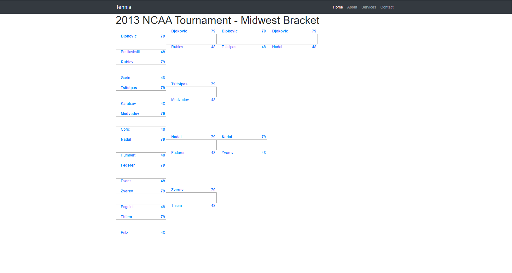
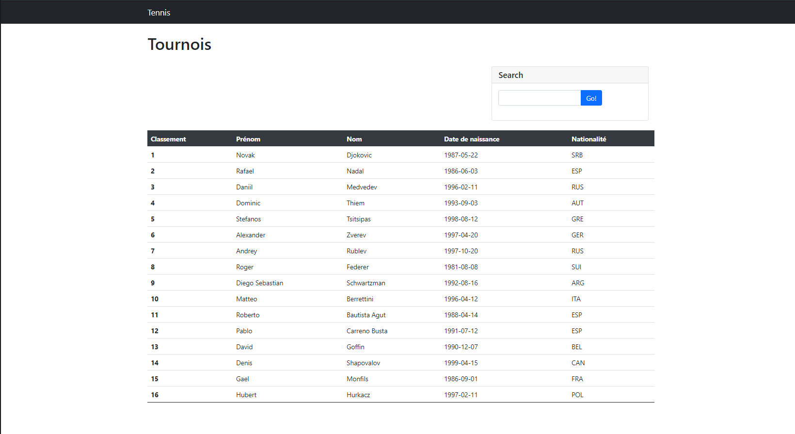
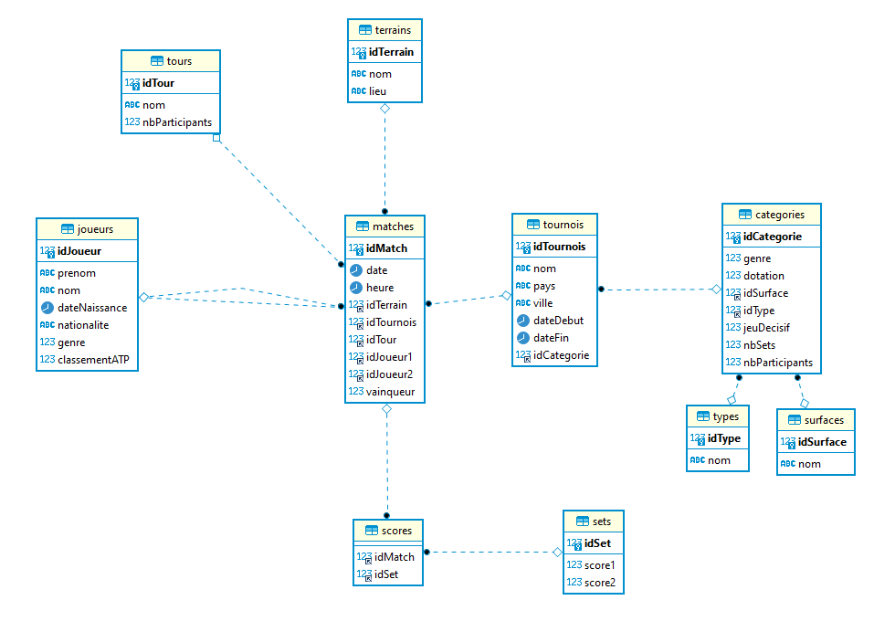

# DOCUMENTATION TECHNIQUE <!-- omit in toc -->
# Tennis <!-- omit in toc -->

***CFPT-Informatique***

## Tables des matières <!-- omit in toc -->

- [1. Table des versions](#1-table-des-versions)
- [2. Introduction](#2-introduction)
- [3. Résumé du cahier des charges](#3-résumé-du-cahier-des-charges)
  - [3.1. Organisation](#31-organisation)
  - [3.2. Livrables](#32-livrables)
  - [3.3. Matériel et logiciels à disposition](#33-matériel-et-logiciels-à-disposition)
  - [3.4. Description de l'application](#34-description-de-lapplication)
- [4. Méthodologie](#4-méthodologie)
  - [4.1. S'informer](#41-sinformer)
  - [4.2. Planifier](#42-planifier)
  - [4.3. Décider](#43-décider)
  - [4.4. Réaliser](#44-réaliser)
  - [4.5. Contrôler](#45-contrôler)
  - [4.6. Evaluer](#46-evaluer)
- [5. Planification](#5-planification)
  - [5.1. Product Backlog](#51-product-backlog)
  - [5.2. Plan previsionnel](#52-plan-previsionnel)
- [6. Analyse Fonctionnelle](#6-analyse-fonctionnelle)
  - [6.1. Fonctionnalités](#61-fonctionnalités)
  - [6.2. Description des fonctionnalités](#62-description-des-fonctionnalités)
  - [6.3. Mesure de sécurité](#63-mesure-de-sécurité)
- [7. Analyse Organique](#7-analyse-organique)
  - [7.1. Technologies utilisées](#71-technologies-utilisées)
  - [7.2. Environnement](#72-environnement)
  - [7.3. Description de la base de données](#73-description-de-la-base-de-données)
    - [7.3.1. Modèle logique de données](#731-modèle-logique-de-données)
- [8. Tests](#8-tests)
  - [8.1. Environnement des tests](#81-environnement-des-tests)
  - [8.2. Plan de test](#82-plan-de-test)
  - [8.3. Rapport de test](#83-rapport-de-test)
- [9. Conclusion](#9-conclusion)
  - [9.1. Difficultés rencontrées](#91-difficultés-rencontrées)
  - [9.2. Amélioration](#92-amélioration)
  - [9.3. Bilan personnel](#93-bilan-personnel)
  - [9.4. Remerciement](#94-remerciement)
- [10. Bibliographie](#10-bibliographie)
- [11. Annexes](#11-annexes)
  - [11.1. Planning Prévisionnel](#111-planning-prévisionnel)
  - [11.2. Planning Effectif](#112-planning-effectif)
  - [11.3. Comparaison](#113-comparaison)
  - [11.4. Code Source](#114-code-source)

## Glossaire <!-- omit in toc -->
> * Responsive : adapté (Lorsqu'on modifie la taille du site et qu'il s'adapte)
> * Pop-up : Fenêtre qui s'ouvre devant la fenêtre principale.
> * Input : Entrée de données dans un système informatique
> * Framework : Fondation d'une partie d'un logiciel
> * Template : Example sur lequel on se base pour réaliser un logiciel

## 1. Table des versions

| N° de version | Date       | Auteur        | Changements apportés |
| ------------- | ---------- | ------------- | -------------------- |
| 1.0.0         | 20.05.2021 | Bonvallat Dan | Rendu final du TPI   |

## 2. Introduction
> Ce document est un rapport montrant la conception du projet.
> Ce projet, réalisé dans le cadre du TPI (Travail Pratique Individuel), permet de valider mes compétences dans le but de l'obtention du CFC.
> Le site web Tennis est un site web permettant la gestion de tournois de tennis. Le tournoi prend en compte plusieurs paramètres comme le type de tournois, le nombre de set ou encore le genre (homme/femme) de joueur qui peut participer au tournoi.

## 3. Résumé du cahier des charges
> Je dois réaliser un site web en adéquation avec le cahier des charges qui m'a été fourni
> Le site web doit permettre à un utilisateur de créer, modifier, copier, supprimer un tournoi de tennis.
> L'utilisateur peut voir les joueurs du tournoi choisit ainsi que d'effectuer des recherches.
> L'utilisateur peut aussi faire des recherches de tournoi.
> Le site web permet de visualiser les matches d'un tournoi, sur chaque match l'utilisateur peut rentrer les résultats des matches.

### 3.1. Organisation

| Elève              | Formateur                | Expert                      | Expert                    |
| ------------------ | ------------------------ | --------------------------- | ------------------------- |
| Bonvallat Dan      | Bergeret Patrick Joseph  | Strazzeri Mickaël           | Vanini Daniel             |
| dan.bnvll@eduge.ch | edu-bergeretpj@edu.ge.ch | mickael.strazzeri@git-it.ch | daniel.vanini@skyguide.ch |

### 3.2. Livrables
* Planning prévisionnel
* Planning effectif
* Documentation technique avec codes sources
* Manuel utlisateur
* Résumé du rapport du TPI
* Journal de bord

### 3.3. Matériel et logiciels à disposition
 Un PC standard école, 2 écrans
 Windows 10
 EasyPHP, Laragon, WAMP ou autre
 mysql workbench, phpmyadmin
 Visual Studio Code
 Suite Office

### 3.4. Description de l'application
> L’application permet de réaliser la gestion de tournois de tennis. Elle fournit une planification des matchs, l’inscription des joueurs et l’enregistrement des résultats des matchs. L’application se compose de deux parties : 
> * Gestion des tournois,
> * Gestion des matchs.
> 
> Les fonctionnalités disponibles sont les suivantes :
> * Créer, modifier, supprimer, copier un tournoi, 
> * La liste des joueurs inscrits au tournoi est fournie, 
> * Planifier les matchs, 
> * Enregistrer les résultats des matchs,
> * Effectuer des recherches : liste des joueurs, joueurs inscrits à un tournoi, liste des matchs, résultat, vainqueur, perdant d’un mach, résultats des match, …
> 
> Règles de gestion
> Tournois :
> * La création est faite avant le début du tournoi,
> * Le processus de création comporte trois étapes :
> ◦ Initialisation avec les informations du tournoi
> ◦ Répartition des joueurs dans les tableaux haut et bas,
> ◦ Planification des matchs
> * Après la date de début du tournoi le tournoi est automatiquement verrouillé,
> * Le tournoi est aussi verrouillé sur demande explicite,
> * Une fois verrouillé le tournoi ne peut plus être modifié ni supprimé,
> * Copier un tournoi,
> * Le tournoi ne prend en charge que des matchs en simple,
> * Le genre est masculin ou féminin,
> * Le nombre de sets est trois ou cinq
> * La surface est : terre battue, gazon, surface rapide, …
> * La catégorie est : Grand Chelem, Masters, Masters 1000, ATP 500 Series, ATP 250 Series, ATP Challenge Tour, …
> * Tournoi avec ou sans jeu décisif.
> 
> Joueurs :
> * La liste des joueurs inscrits au tournoi est fournie.
> 
> Matchs :
> * Un match se joue en trois ou cinq sets (défini au niveau du tournoi)
> * Le joueur qui gagne deux sets ou trois sets est déclaré vainqueur.
> * Un match est gagné par forfait si un joueur abandonne en cours de match ou déclare forfait avant le début du match. Le score est celui au moment de l’abandon ou reste non rempli.
> 
> Sets :
> * Dans un tournoi sans jeu décisif, le joueur qui gagne six jeux ou plus avec au moins deux jeux d’écart, remporte le set, exemples 6-1, 6-4, 7-5, 10-8, 14-12, …
> * Dans un tournoi avec jeu décisif, le joueur qui gagne six ou sept jeux avec deux jeux d’écart ou en cas d’égalité 6-6, gagne le jeu décisif, remporte le set, exemples 6-0, …, 6-4, 7-5 ou 7-6
> 
> Jeux :
> * Un jeu est remporté par le joueur qui arrive à quatre points ou plus avec au moins deux points d’écart,
> * Un jeu décisif est gagné par le joueur qui arrive à six points minimum avec deux points d’écart.
> 
> Planification :
> * Un tournoi est composé de deux tableaux : haut et bas,
> * La répartition des joueurs se fait en fonction des têtes de série,
> * Les têtes de série impaires sont placées dans le tableau haut,
> * Les têtes de série paires sont placées dans le tableau bas,
> * Le nombre de tours dans le tournoi dépend du nombre de participants, exemple pour 32 participants, 5 tours à jouer finale incluse (1er tour, 2e tour, ¼, ½ et finale),
> * Les quatre premières têtes de série ne se rencontre qu’à partir des ¼ de finales.
> 
> Interfaces
> 
> « menus »
> Tournois : liste, affiche, recherche, crée, modifie, supprime, copie, verrouille
> Joueurs : liste, affiche, recherche
> Matchs : planifie, répartie les joueurs dans les tableaux, consulte
> Résultats : enregistre, modifie, efface, consulte
> 
> « accueil »
> La page d’accueil affiche par défaut le dernier tournoi consulté, avec ses informations.
> Une zone de recherche présente une liste déroulante avec les tournois, un clic sur un tournoi, met à jour l’affichage avec les informations du tournoi sélectionné.
> 
> « tournois »
> La page affiche la liste des tournois.
> Les actions disponibles : rechercher, voir, créer, modifier, supprimer, copier et verrouiller un tournoi.
> 
> « joueurs »
> La page affiche la liste des joueurs.
> Les actions disponibles : rechercher, voir un joueur.
> 
> « matchs »
> La page affiche la liste des matchs du tournoi sélectionné.
> Les actions disponibles : rechercher, planifier, répartir les joueurs et voir un match.
> 
> « résultats »
> La page affiche le score d’un match.
> Les actions disponibles : sélectionner, enregistrer, modifier et effacer le score d’un match.

## 4. Méthodologie
> Afin de planifier mon projet, j'utilise la méthodologie en six étapes.

### 4.1. S'informer
> La première chose que j'ai faite est de lire attentivement l'énoncé de mon tpi
> Après la lecture du tpi, j'ai appelé mon formateur afin de lui poser des questions sur l'énoncer.

### 4.2. Planifier
> Au début du projet, j'ai découpé le travail que je devais faire pour savoir ce qui est le plus important, et savoir ce qui peut possiblement poser plus de problème.
> Pour tous les points de l'énoncé, j'ai fixé une priorité afin d'avoir un ordre d'importance pour réaliser les taches que j'ai a faire. Les niveaux sont:
> * B, Bloquant, X
> * C, Critique, !
> * I, Important, +
> * S, Secondaire, - 

> Après avoir découpé mon travail, j'ai stocké chaque partie dans un product backlog.
> Une fois terminé, j'ai créé un planing prévisionnel afin d'avoir une ligne directrice.

### 4.3. Décider
> Lors de la réalisation de mon projet, j'ai couramment dû prendre des décisions et faire des choix. 
> Quand je dois faire un choix je réfléchis longuement afin de prendre la meilleur décision possible. Il arrive, des fois, que certains choix soient compliqués à prendre, alors, lorsque j'ai un doute j'en fais part à mon formateur.

### 4.4. Réaliser
> Après avoir pris les décisions qui me semble justes, je continue sur le travail qui m'a posé problème précédement (Implémentation de code ou rédaction de la documentation).

### 4.5. Contrôler
> Dès qu'une fonctionnalité est terminé je vais immédiatement la tester dans plusieurs cas différents pour être sur que la fonctionnalité fonctionne bien.
> Lorsque le site web est terminé, je teste l'ensemble des fonctionnalitées du site.

### 4.6. Evaluer
> Pour finir, j'applique cette dernière étape pour pouvoir savoir ce qui peut être améliorable. Grace au journal de bord, sur lequel je note chacune de mes actions, je peux relire tous ce que j'ai fais dans la journée et donc voir où il y a des points améliorables.

## 5. Planification

### 5.1. Product Backlog

| Nom         | 1: Créer un tournoi                                          |
| ----------- | ------------------------------------------------------------ |
| Description | En tant qu'utilisateur je peux créer un tournoi en remplissant un formulaire |
| Priorité    | B: Bloquant X                                                |

| Nom         | 2: Rechercher un tournoi                                     |
| ----------- | ------------------------------------------------------------ |
| Description | En tant qu'utilisateur je peux rechercher un tournoi via une barre de recherche |
| Priorité    | S: Secondaire -                                              |

| Nom         | 3: Modifier un tournoi                                       |
| ----------- | ------------------------------------------------------------ |
| Description | En tant qu'utilisateur je peux modifier les conditions d'un tournoi après sa création |
| Priorité    | S: Secondaire -                                              |

| Nom         | 4: Supprimer un tournoi                             |
| ----------- | --------------------------------------------------- |
| Description | En tant qu'utilisateur je peux supprimer un tournoi |
| Priorité    | I: Important +                                      |

| Nom         | 5: Enregistrer les résultats des matchs                      |
| ----------- | ------------------------------------------------------------ |
| Description | En tant qu'utilisateur je peux sauvgarder le résultat du match |
| Priorité    | I: Important +                                               |

| Nom         | 6: Planifier les matchs                                      |
| ----------- | ------------------------------------------------------------ |
| Description | En tant qu'utilisateur je peux planifier la date des matches |
| Priorité    | I: Important +                                               |

| Nom         | 7: Rechercher un joueur                                      |
| ----------- | ------------------------------------------------------------ |
| Description | En tant qu'utilisateur je peux rechercher un joueur et savoir dans quel tournoi il est inscrit |
| Priorité    | I: Important +                                               |

| Nom         | 4: Copier un tournoi                             |
| ----------- | ------------------------------------------------ |
| Description | En tant qu'utilisateur je peux copier un tournoi |
| Priorité    | S: Secondaire -                                  |

### 5.2. Plan previsionnel 

> Voici le plan prévisionnel que j'ai réalisé

## 6. Analyse Fonctionnelle
> Il y au totale 5 pages dans mon site web. Sur l'une d'entre elles (tournois.php) il y a un pop up qui fait apparaitre les 2 joueurs, l'utilisateur peut enregistrer les résultats des 2 joueurs
> Pour réaliser ces pages, j'ai fais un croquis

> Après avoir fais le croquis sur papier, je decide de faire un squelette du site

> Je commence alors par créer la page index.php. Cette page est un menu ou ce trouve les tournois créé par l'utilisateur.
> Je créé ensuite la page creation.php. Cette page est un formulaire ou l'utilisateur pourra créer un tournoi. 

### 6.1. Fonctionnalités
> Sur la page index.php, l'utilisateur peut créer un tournoi en appuyant sur un bouton créer qui l'emenera sur la page création.php. Une fois le tournoi créé, le tournoi s'affichera dans le compartiment en gris. A coté du tournoi, se trouvera un bouton pour supprimer le tournoi, un bouton modifier, un autre pour voir le tournoi et un dernier pour copier le tournoi.
> La page index.php peut également faire une recherche du tournoi.
> Cette page ressemble à ça

> Sur la page creation.php, l'utilisateur a un formulaire avec plusieurs champs. Il doit remplir les champs pour créer le tournoi.

> La page modification.php est pareil que la page creation.php. La différence est que lorsque l'utilisateur appuie sur le bouton modifié d'un tournoi, l'utilisateur se retrouvera sur une page pareil à la page creation.php, sauf que les données du tournoi sont déjà entrées dans les champs du formulaire, alors l'utilisateur a juste à modifier le champ qui lui convient pas.

> Lorsque l'utilisateur clique sur le bouton voir d'un tournoi sur la page index.php, il sera envoyé sur la page tournoi.php. C'est sur cette page qu'aura lieu les matchs et ou l'utilisateur entre le score des différents matchs.

> Quand un utilisateur appuie sur le bouton supprimé, le tournoi est supprimé.

> Un bouton copier permet de recréer un tournoi identique à celui dont l'utilisateur a cliqué

> Lorsque l'utilisateur clique sur le bouton joueurs d'un tournoi dans la page index, il sera redirigé sur la page joueurs.php ou un tableau s'affichera avec les joueurs du tounoi. Il pourra aussi faire des recherches de joueurs par le nom ou le prénom.

### 6.2. Description des fonctionnalités
> Sur la page index l'utilisateur peut rechercher un tournoi. Il doit juste entré un mot dans la barre de recherche et à appuyer sur le bouton recherche et les tournoi vont apparaîtres du plus au moins pertinent.
>  Il peut également appuyer sur les bouton créer, modifier, voir, copier et supprimer. 
> Sur la parge creation, l'utilisateur peut rentrer différentes données dans les champs du formulaire. Il peut ensuite cliquer sur le bouton créer qui va envoyer les données dans la base de données et l'utilisateur sera redirigé sur la page index.
> Sur la page modification.php l'utilisateur peut modifier un ou plusieurs des champs du formulaire. Une fois qu'il appuie sur le bouton modifier, les données seront envoyées dans la base de données et vont remplacer les anciennes données. L'utilisateur sera redirigé sur la page index.php.
> Lorsque l'utilisateur appuie sur le bouton supprimé, les données du tournoi vont être envoyées sur une page supprimer.php afin de supprimer les données de la base de données. L'utilisateur ne change pas de page.
> Lorsque l'utilisateur clique sur le bouton copier, un deuxième tournoi, identique à celui dont l'utilisateur a cliquer précédement, sera créé.
> Si l'utilisateur clique sur le bouton joueurs d'un tournoi, il sera redirigé sur une page ou les joueurs du tournoi seront affiché. Sur cette page il pourra effectuer des recherches par rapport au nom et prénom des joueurs.
> Lorsque l'utilisateur clique sur le bouton voir, il sera redirigé sur la page tournoi.php. Sur cette page l'utilisateur pourra entrer les données des matches comme la date de la rencontre et les points des matches.
> Il pourra aussi télécharger la fiche du matche.

> Lorsque l'utilisateur clique sur le bouton copier d'un tournoi, un nouveau tournoi sera créé avec les mêmes informations que le tournoi dont l'utilisateur à cliqué sur le bouton copier

### 6.3. Mesure de sécurité
> Pour ce qui est de la sécurité, je filtre toujours les inputs avant de traiter les données. Lorsque je passe des données en get, je les filtre directement sur la page ou les données ont été envoyé.

## 7. Analyse Organique

### 7.1. Technologies utilisées
> Les technologies qui sont utilisé dans ce projet sont:
> * php
> Le php est principalement utilisé pour traiter les données, sécuriser le site et faire les traitements avec la base de données
> * css
> Le css est utiliser pour décorer le site web mais aussi pour faciliter l'utilisation de l'utilisateur lorsqu'il navigue sur le site.
> * html
> L'html permet de construire le site et de permettre certaines actions qui nécessite du php 
> * sql
> L'sql permet de traiter les informations qu'il reçoit dans la base de données et permet l'accès au php afin de permettre aux informations de circuler entre le site web et la base de données.
> * mariaDB
> MariaDB est un système de gestion de base de données
> * markdown
> Le markdown est très lisible et très graphique, rédaction rapide. Utilisé pour rédiger des documents.
> * debian
> Debian est une interface linux sous lequel il peut héberger un serveur apache
> * apache2
> Apache2 est un serveur qui permet de faire le lien entre la base de donnée et le site web
> * wsl
> Wsl est une couche de compatibilité permettant d'executer des executable Linux sur Windows

> Pour ce qui est de la template du site et du design, plusieurs outils.
> * Bootstrap
> Framework CSS permettant de développer **responsive**. Bootstrap aide aussi au dévloppement du design en ayant déjà des composants préfait. J'ai donc utilisé quelque composant pour la création de mon site (pour les fomrulaire, principalement).
> * Start Bootstrap
> Template bootstrap gratuite. J'ai donc choisit une template pour mon site sur ce site.
> * CodePen
> Site web sur lequel la communauté peut partager du code HTML, CSS et JavaScript. Sur ce site, j'ai trouvé la template de mon tournoi dont le code HTML et CSS ont été partagé par un utilisateur.

### 7.2. Environnement

> Pour la plupart des technologies utilisées, j'utilise Visual Studio Code.
> Visual Studio Code est un éditeur de code dévloppé par Microsoft pour Windows.
> La communauté peut développer des extensions qui permet de coder de manière plus ergonomique. J'utilise Visual Studio Code pour le php, le css, l'html, markdown et wsl.
> Pour le sql j'utilise le programme DBeaver.
> Pour le serveur j'utilise apache2 sur l'interface Linux Debian.

### 7.3. Description de la base de données
La base de données compte 12 tables dont deux tables qui contiennent juste les id deux deux autres tables.
Les tables sont :
> * matchs
> Contient les informations des matches, lié avec la table tournoi, tours, scores, joueur, terrains
> * tournoi
> Contient les informations du tournoi comme son nom ou encore l'endroit ou il se trouve. Lié avec la table matches et categories.
> * categories
> Contient les informations concernant les catégories des tournois comme le genre, le nombre de sets gagnant ou la dotation. Lié avec la table tournoi, surfaces et types
> * sufaces
> Contient le type de surface d'un terrain de tennis. Lié avec la table catégorie
> * types
> Contient le type du tournoi (Grand Chelem, master 1000, ...). Lié avec la table categories.
> * tours
> Contient le type de tours (demi-finale, finale, ...). Lié avec la table matches
> * terrains
> Contient l'enplacement des terrains et leur nom comme terrainA - Nord. Lié avec la table matchs
> * scores
> Contient les id de la tables matchs et la table sets. Lié avec la table sets et matchs.
> * sets
> Contient le score d'un set. Lié avec la table scores 
> * joueurs
> Contient les informations des joueurs du tournoi. Lié avec la table matches.
#### 7.3.1. Modèle logique de données

> Voici ce que donne la base de donnée à la fin du projet.

## 8. Tests
> Pour réaliser ce projet, j'ai écris des protocoles de tests pour simuler une utilisation du site par un quelconque utilisateur.  
### 8.1. Environnement des tests
> Les tests ont été effectué sur les naviguateur Google Chrome et Mozilla Firefox.
> Les tests ont été effectué sur un ordinateur utilisant Windows

### 8.2. Plan de test

| N°   | Description du test                                          | Résultat attendu                                             |
| ---- | ------------------------------------------------------------ | ------------------------------------------------------------ |
| 1    | L'utilisateur a remplit le formulaire de création et a cliqué sur le bouton validé | Les données ont été envoyées à la base de données, un tournoi a été créé, l'utilisateur est redirigé sur la page principale et le tournoi créé apparait |
| 2    | L'utilisateur a remplit le formulaire de modification et a cliqué sur le bouton modifier | Les données sont envoyé à la base de données, le tournoi est modifier, l'utilisateur est redirigé sur la page principale et le tournoi a été modifié |
| 3    | L'utilisateur clique sur le bouton supprimer d'un tournoi    | Les données du tournoi sont traitées dans la base de données, les données sont supprimées, la page se recharge et le tournoi a disparu |
| 4    | L'utilisateur clique sur le bouton copier d'un tournoi       | Les données du tournoi sont traitées dans la base de données, les données sont recréées avec un nouvel id, la page se recharge et un nouveau tournoi apparait |
| 5    | L'utilisateur clique sur le bouton joueurs d'un tournoi      | L'utilisateur est redirigé sur la page joueurs. Un tableau des joueurs du tournoi apparait |
| 6    | L'utilisateur cherche un mot dans la barre de recheche de la page pricipale et clique sur le bouton | Tous les tournoi où leur nom contient le groupe de mot choisit par l'utilisateur apparaissent |
| 7    | L'utilisateur cherche un mot dans la barre de recheche de la page joueur et clique sur le bouton | Tous les joueurs où leur nom et prénom contient le groupe de mot choisit par l'utilisateur apparaissent |
| 8    | L'utilisateur clique sur le bouton voir d'un tournoi         | L'utilisateur est redirigé sur la page tournoi, un tournoi apparait avec le premier tour déjà complété (matchs) |
| 9    | L'utilisateur clique sur le bouton valider du formulaire d'un match dans la page tournois | Les informations sont envoyées dans la base de données, le joueur ayant gagné le match passe au prochain tour |
| 10   | L'utilisateur clique sur le mot "Tennis" dans la barre de navigation d'une page | L'utilisateur va directement être redirigé sur la page principale du site |
| 11   | L'utilisateur clique sur le bouton téléchargé du formulaire après avoir entré les informations des matches | Un pdf avec les informations du match sera téléchargé pour l'utilisateur |

### 8.3. Rapport de test

> OK -> le test fonctionne / NOK -> le test ne fonctionne pas

| N°   | Description du test                                          | Résultat obtenu                                              |
| ---- | ------------------------------------------------------------ | ------------------------------------------------------------ |
| 1    | L'utilisateur a remplit le formulaire de création et a cliqué sur le bouton validé | Les données sont envoyées dans la base de données et l'utilisateur est renvoyé sur la page principale (OK) |
| 2    | L'utilisateur a remplit le formulaire de modification et a cliqué sur le bouton modifier | Les données sont bien envoyées dans la base de données, le tournoi est bien modifier et l'utilisateur est redirigé sur la page pricipale (OK) |
| 3    | L'utilisateur clique sur le bouton supprimer d'un tournoi    | Les données du tournoi sont traitées dans la base de données, les données sont supprimées. La page se recharche et le tournoi a disparu (OK) |
| 4    | L'utilisateur clique sur le bouton copier d'un tournoi       | Les données du tournoi sont traitées dans la base de données, les données sont recréées avec un nouvel id, la page se recharge et un nouveau tournoi apparait |
| 5    | L'utilisateur clique sur le bouton joueurs d'un tournoi      | L'utilisateur est redirigé sur la page joueur, un tableau des joueurs du tournoi apparait avec toutes les informations de chaque joueur (OK) |
| 6    | L'utilisateur cherche un mot dans la barre de recheche de la page pricipale et clique sur le bouton | Le mot entré par l'utilisateur fait apparaitre tous les tournois, avec toutes leurs informations, qui contiennent le mot entré par l'utilisateur dans leur nom de touroi (OK) |
| 7    | L'utilisateur cherche un mot dans la barre de recheche de la page joueur et clique sur le bouton | Le mot entré par l'utilisateur fait apparaitre tous les joueurs, avec toutes leurs informations, qui contiennent le mot entré par l'utilisateur dans leur nom ou prémom (OK) |
| 8    | L'utilisateur clique sur le bouton voir d'un tournoi         | L'utilisateur est redirigé sur la page tournoi, le tournoi apparait avec le premier tour déjà complété (matches) (OK) |
| 9    | L'utilisateur clique sur le bouton valider du formulaire d'un match dans la page tournoi | La date, le terrain et l'heure sont envoyés dans la base de données. Les sets ne sont pas envoyés dans la base de données. C'est que le joueur 1 qui passe les tours à chaque fois, le joueur 1 est toujours le vainqueur. L'utilisateur ne peut ajouter les données de la finale. Le reste des tours est fonctionnel pour l'ajout de la date, l'heure et le terrain. (NOK) |
| 10   | L'utilisateur clique sur le mot "Tennis" dans la barre de navigation d'une page | L'utilisateur est directement redirigé sur la page principale (OK) |
| 11   | L'utilisateur clique sur le bouton téléchargé du formualaire après avoir entré les informations des matches | La fonctionnalité n'a pas été devloppé (NOK)                 |
## 9. Conclusion
### 9.1. Difficultés rencontrées
> Je n'ai pas spécialement rencontré de difficulté pour la plupart des fonctionnalités sauf lorsque j'ai du commencé la planification des matchs. Quand j'ai commencé la planification des matchs je n'avais pas encore créé toutes les fonctions qui étaient demandées dans le cahier des charges. La planification a pris beaucoup plus de temps que prévu, elle n'est d'ailleurs toujours pas terminé. Je ne m'étais pas rendu compte du temps que cette tâche allait me prendre. Dès lors que j'ai compris que je n'arriverais pas à faire tout ce qui est demandé dans le cahier des charges, j'ai envoyé un mail aux experts ainsi qu'a mon fomrateur afin de les prévenirs des difficultés que je rencontrais. Ils m'ont aidé et ont supprimé la plupart des tâches que je n'avais pas encore réalisé, mise à part la planification.

> Lorsque j'ai contacté les experts afin de les prévenir des difficultés que je rencontrais, j'ai été informé, en retour, qu'il y avait eu un problème avec les demandes du cahier des charges. Il y avait trop de tâche à faire. Cela m'a donc motiver à finir au mieux mon tpi. 

### 9.2. Amélioration
> Il y a, évidement, la planification des matchs à finir et à rendre fonctionnel.
> Il y faut aussi mettre des restrictions sur les pages afin que l'utilisateur créer des erreurs.
> Améliorer le coté graphique du site 

### 9.3. Bilan personnel
> J'ai beaucoup aimé faire ce travail car je suis fier du résultat du projet que j'ai réalisé.
> Réaliser ce travail était ma principale motivation, plus que de réussir le tpi.
> J'ai fais ce que j'ai pu et je suis content de ce que le projet est devenu.
> Le seul point ou je suis un peu déçu, c'est le fait que je n'ai pas réussi à réaliser la planification des matches.
> Je suis même assez content d'avoir rencontré le problème que j'ai eu car c'est une expérience qui fait que je suis d'autent plus fier de ce que j'ai réalisé.

### 9.4. Remerciement

> Je tiens à remercier:
> * Mr Bergeret pour m'avoir suivi durant mon TPI
> * Mr Vanini pour avoir entendu le problème que j'ai rencontré et de m'avoir aidé
> * Mr Strazzeri pour avoir entendu le problème que j'ai rencontré et de m'avoir aidé

## 10. Bibliographie

> * [Bootstrap](https://getbootstrap.com)
> * [Start Bootstrap](https://startbootstrap.com)
> * [CodePen - Tournament Bracket](https://blog.codepen.io/2018/02/16/need-make-tournament-bracket/)

## 11. Annexes
[DOCUMENTATION UTILISATEUR <!-- omit in toc -->](../docUtilisateur/Documentation%20Utilisateur.pdf)

[Journal de bord](../journalBord/JournalDeBord.pdf)

### 11.1. Planning Prévisionnel

### 11.2. Planning Effectif

### 11.3. Comparaison
> On peut voir que les premiers jours, j'ai assez bien suivis le planning mais on peut voir que la planification des matches m'a prit énormément de temps. 
> J'ai pris aussi moins de temps pour la docuemntation utilisateur et téchnique

### 11.4. Code Source

[Code Source](codeSource.pdf)