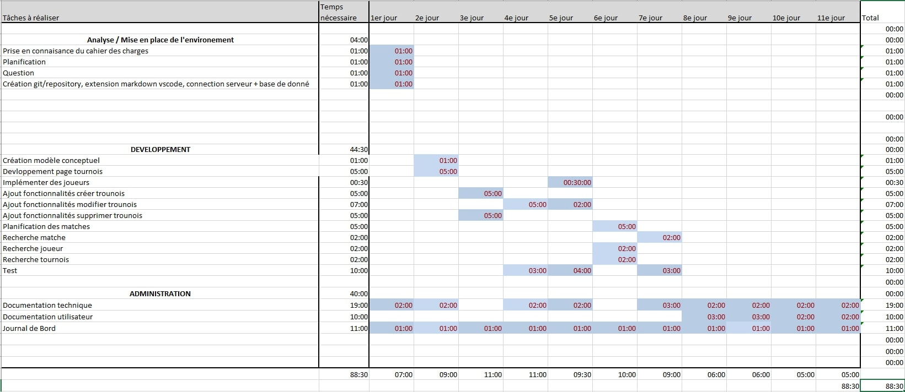
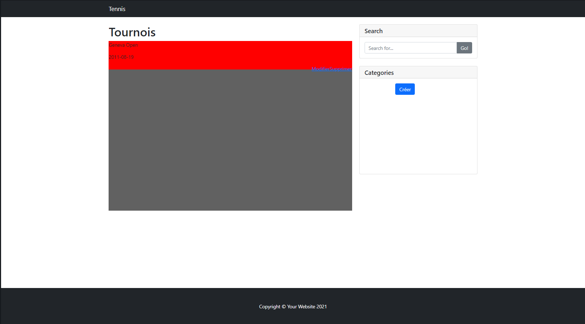
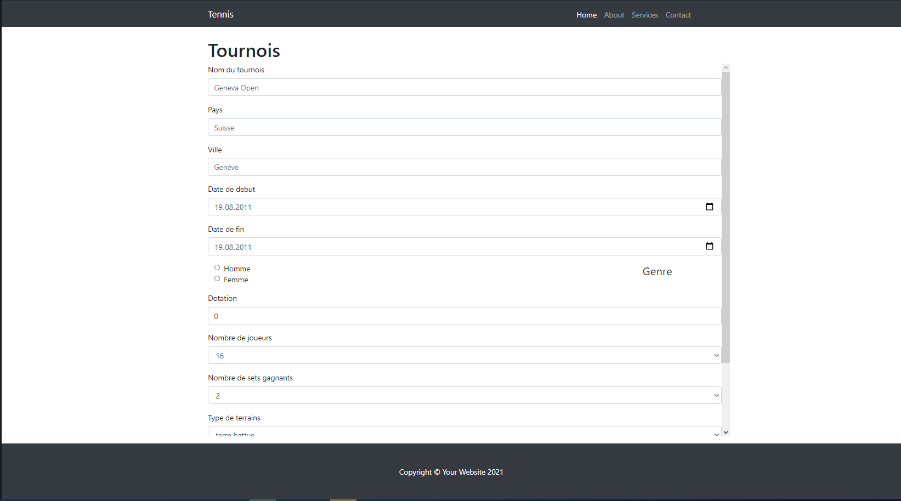
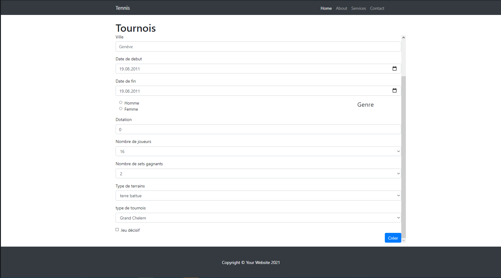
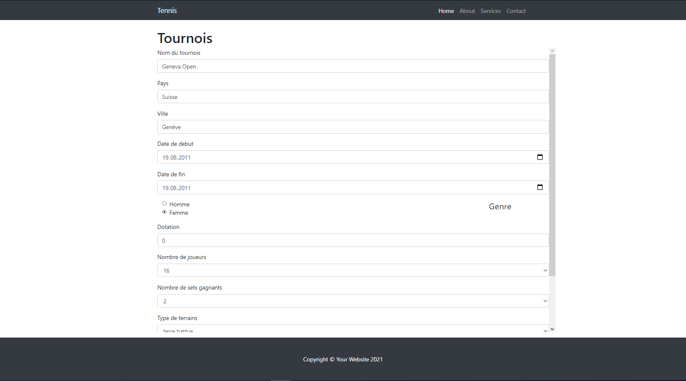
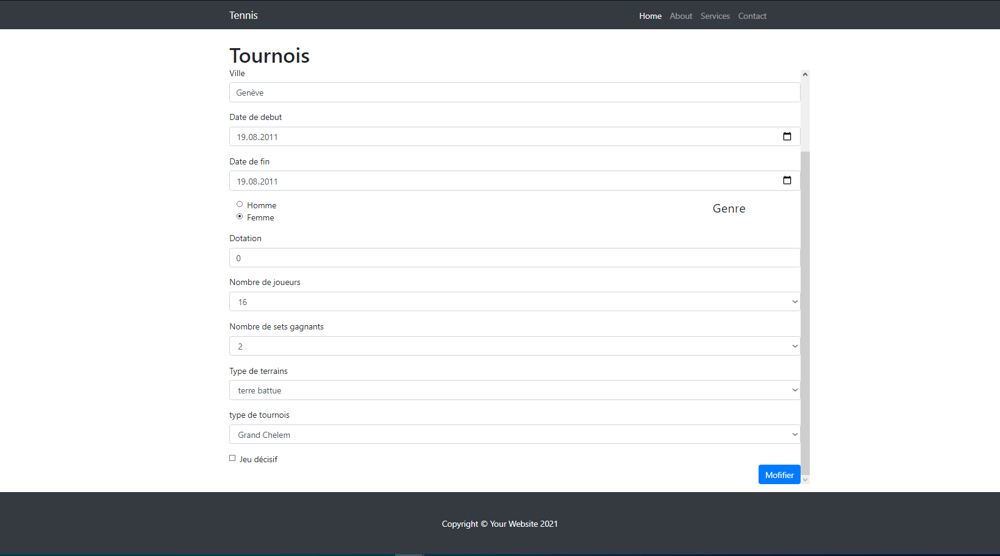

# DOCUMENTATION TECHNIQUE <!-- omit in toc -->
# Tennis <!-- omit in toc -->

***CFPT-Informatique***

## Tables des matières <!-- omit in toc -->

- [1. Table des versions](#1-table-des-versions)
- [2. Introduction](#2-introduction)
- [3. Résumé du cahier des charges](#3-résumé-du-cahier-des-charges)
  - [3.1. Organisation](#31-organisation)
  - [3.2. Livrables](#32-livrables)
  - [3.3. Matériel et logiciels à disposition](#33-matériel-et-logiciels-à-disposition)
  - [3.4. Description de l'application](#34-description-de-lapplication)
- [4. Méthodologie](#4-méthodologie)
  - [4.1. S'informer](#41-sinformer)
  - [4.2. Planifier](#42-planifier)
  - [4.3. Décider](#43-décider)
  - [4.4. Réaliser](#44-réaliser)
  - [4.5. Contrôler](#45-contrôler)
  - [4.6. Evaluer](#46-evaluer)
- [5. Planification](#5-planification)
  - [5.1. Product Backlog](#51-product-backlog)
  - [5.2. Plan previsionnel](#52-plan-previsionnel)
- [6. Analyse Fonctionnelle](#6-analyse-fonctionnelle)
  - [6.1. Fonctionnalités](#61-fonctionnalités)
  - [6.2. Description des fonctionnalités](#62-description-des-fonctionnalités)
  - [6.3. Mesure de sécurité](#63-mesure-de-sécurité)
- [7. Analyse Organique](#7-analyse-organique)
    - [7.0.1. Page index](#701-page-index)
    - [7.0.2. Page Creation](#702-page-creation)
    - [7.0.3. Page Modification](#703-page-modification)
    - [7.0.4. Page Tournois](#704-page-tournois)
    - [7.0.5. Page Joueur](#705-page-joueur)
  - [7.1. Technologies utilisées](#71-technologies-utilisées)
  - [7.2. Environnement](#72-environnement)
  - [7.3. Description de la base de données](#73-description-de-la-base-de-données)
    - [7.3.1. Modèle logique de données](#731-modèle-logique-de-données)
- [8. Tests](#8-tests)
  - [8.1. Environnement des tests](#81-environnement-des-tests)
  - [8.2. Plan de test](#82-plan-de-test)
  - [8.3. Rapport de test](#83-rapport-de-test)
- [9. Conclusion](#9-conclusion)
- [10. Bibliographie](#10-bibliographie)
- [11. Annexes](#11-annexes)
  - [11.1. Planning Prévisionnel](#111-planning-prévisionnel)
  - [11.2. Planning Effectif](#112-planning-effectif)
  - [11.3. Code Source](#113-code-source)

## 1. Table des versions

| N° de version | Date       | Auteur        | Changements apportés |
| ------------- | ---------- | ------------- | -------------------- |
| 1.0.0         | 20.05.2021 | Bonvallat Dan | Rendu final du TPI   |


## 2. Introduction
> Ce document est un rapport montrant la conception du projet.
> Ce projet, réalisé dans le cadre du TPI (Travail Pratique Individuel), permet de valider mes compétances afin l'obtention du CFC.
> Le site web Tennis est un site web permettant la gestion de tournois de tennis. Le tournois prend en compte plusieurs paramètres comme le type de tournois, le nombre de set ou encore le genre (homme/femme) de joueur qui peut participer au tournois.

## 3. Résumé du cahier des charges
> Je dois réaliser un site web en adequation avec le cahier des charges qui m'a été fourni

### 3.1. Organisation


| Elève              | Formateur                | Expert                      | Expert                    |
| ------------------ | ------------------------ | --------------------------- | ------------------------- |
| Bonvallat Dan      | Bergeret Patrick Joseph  | Strazzeri Mickaël           | Vanini Daniel             |
| dan.bnvll@eduge.ch | edu-bergeretpj@edu.ge.ch | mickael.strazzeri@git-it.ch | daniel.vanini@skyguide.ch |


### 3.2. Livrables
* Planning prévisionnel
* Planning effectif
* Documentation technique avec codes sources
* Manuel utlisateur
* Résumé du rapport du TPI
* Journal de bord

### 3.3. Matériel et logiciels à disposition
 Un PC standard école, 2 écrans
 Windows 10
 EasyPHP, Laragon, WAMP ou autre
 mysql workbench, phpmyadmin
 Visual Studio Code
 Suite Office

### 3.4. Description de l'application
> L’application permet de réaliser la gestion de tournois de tennis. Elle fournit une planification des matchs, l’inscription des joueurset l’enregistrement des résultats des matchs. L’application se compose de deux parties : 
> * Gestion des tournois,
> * Gestion des matchs.
> 
> Les fonctionnalités disponibles sont les suivantes :
> * Créer, modifier, supprimer, copier un tournoi, 
> * La liste des joueurs inscrits au tournoi est fournie, 
> * Planifier les matchs, 
> * Enregistrer les résultats des matchs,
> * Effectuer des recherches : liste des joueurs, joueurs inscrits à un tournoi, liste des matchs, résultat, vainqueur, perdant d’un mach, résultats des match, …
> 
> Règles de gestion
> Tournois :
> * La création est faite avant le début du tournoi,
> * Le processus de création comporte quatre étapes :
> ◦ Initialisation avec les informations du tournoi
> ◦ Répartition des joueurs dans les tableaux haut et bas,
> ◦ Planification des matchs
> * Après la date de début du tournoi le tournoi est automatiquement verrouillé,
> * Le tournoi est aussi verrouillé sur demande explicite,
> * Une fois verrouillé le tournoi ne peut plus être modifié ni supprimé,
> * Copier un tournoi,
> * Le tournoi ne prend en charge que des matchs en simple,
> * Le genre est masculin ou féminin,
> * Le nombre de sets est trois ou cinq
> * La surface est : terre battue, gazon, surface rapide, …
> * La catégorie est : Grand Chelem, Masters, Masters 1000, ATP 500 Series, ATP 250 Series, ATP Challenge Tour, …
> * Tournoi avec ou sans jeu décisif.
> 
> Joueurs :
> * La liste des joueurs inscrits au tournoi est fournie.
> 
> Matchs :
> * Un match se joue en trois ou cinq sets (défini au niveau du tournoi)
> * Le joueur qui gagne deux sets ou trois sets est déclaré vainqueur.
> * Un match est gagné par forfait si un joueur abandonne en cours de match ou déclare forfait avant le début du match. Le score est celui au moment de l’abandon ou reste non rempli.
> 
> Sets :
> * Dans un tournoi sans jeu décisif, le joueur qui gagne six jeux ou plus avec au moins deux jeux d’écart, remporte le set, exemples 6-1, 6-4, 7-5, 10-8, 14-12, …
> * Dans un tournoi avec jeu décisif, le joueur qui gagne six ou sept jeux avec deux jeux d’écart ou en cas d’égalité 6-6, gagne le jeu décisif, remporte le set, exemples 6-0, …, 6-4, 7-5 ou 7-6
> 
> Jeux :
> * Un jeu est remporté par le joueur qui arrive à quatre points ou plus avec au moins deux points d’écart,
> * Un jeu décisif est gagné par le joueur qui arrive à six points minimum avec deux points d’écart.
> 
> Planification :
> * Un tournoi est composé de deux tableaux : haut et bas,
> * La répartition des joueurs se fait en fonction des têtes de série,
> * Les têtes de série impaires sont placées dans le tableau haut,
> * Les têtes de série paires sont placées dans le tableau bas,
> * Le nombre de tours dans le tournoi dépend du nombre de participants, exemple pour 32 participants, 5 tours à jouer finale incluse (1er tour, 2e tour, ¼, ½ et finale),
> * Les quatre premières têtes de série ne se rencontre qu’à partir des ¼ de finales.
> 
> Interfaces
> 
> « menus »
> Tournois : liste, affiche, recherche, crée, modifie, supprime, copie, verrouille
> Joueurs : liste, affiche, recherche
> Matchs : planifie, répartie les joueurs dans les tableaux, consulte
> Résultats : enregistre, modifie, efface, consulte
> 
> « accueil »
> La page d’accueil affiche par défaut le dernier tournoi consulté, avec ses informations.
> Une zone de recherche présente une liste déroulante avec les tournois, un clic sur un tournoi, met à jour l’affichage avec les informations du tournoi sélectionné.
> 
> « tournois »
> La page affiche la liste des tournois.
> Les actions disponibles : rechercher, voir, créer, modifier, supprimer, copier et verrouillé un tournoi.
> 
> « joueurs »
> La page affiche la liste des joueurs.
> Les actions disponibles : rechercher, voir un joueur.
> 
> « matchs »
> La page affiche la liste des matchs du tournoi sélectionné.
> Les actions disponibles : rechercher, planifier, répartir les joueurs et voir un match.
> 
> « résultats »
> La page affiche le score d’un match.
> Les actions disponibles : sélectionner, enregistrer, modifier et effacer le score d’un match.

## 4. Méthodologie
> Afin de planifier mon projet, j'utilise la méthodologie en six étapes.

### 4.1. S'informer
> La première chose que j'ai faite est de lire attentivement l'énoncé de mon tpi
> Après la lecture du tpi, j'ai appelé mon formateur afin de lui poser des questions sur l'énoncer.

### 4.2. Planifier
> Au début du projet, j'ai découpé le travail que je devais faire pour savoir ce qui est le plus important, et savoir ce qui peut possiblement poser plus de problème.
> Pour tous les points de l'énoncé, j'ai fixé une priorité afin d'avoir un ordre d'importance pour réaliser les taches que j'ai a faire. Les niveaux sont:
> * B, Bloquant, X
> * C, Critique, !
> * I, Important, +
> * S, Secondaire, - 

> Après avoir découpé mon travail, j'ai stocké chaque partie dans un product backlog.
> Une fois terminé, j'ai créé un planing prévisionnel afin d'avoir une ligne directrice.


### 4.3. Décider
> Lors de la réalisation de mon projet j'ai  courement du prendre des décisions et faire des choix. 
> Quand je dois faire un choix je réfléchis longuement afin de prendre la meilleur décision possible. Il arrive, des fois, que certains choix soient compliqués à prendre, alors, lorsque j'ai un doute j'en fais part à mon formateur.

### 4.4. Réaliser
> Après avoir prit les décisions qui me semble juste, je continue sur le travail qui m'a posé problème précédement (Implémentation de code ou rédaction de la documentation).

### 4.5. Contrôler
> Dès qu'une fonctionnalité est terminé je vais immédiatement la tester dans plusieurs cas différent pour être sur que la fonctionnalité fonctionne bien.
> Lorsque le site web est terminé, je teste l'ensemble des fonctionnalitées du site.

### 4.6. Evaluer
> Pour finir, j'applique cette dernière étape pour pouvoir savoir ce qui peut être améliorable. Grace au journal de bord, ou je note tous ce que je fais, je peux relire tous ce que j'ai fais la journé et donc voir ou il y a des points améliorables.

## 5. Planification

### 5.1. Product Backlog

| Nom         | 1: Créer un tournois                                                          |
| ----------- | ----------------------------------------------------------------------------- |
| Description | En tant qu'utilisateur je peux créer un tournois en remplissant un formulaire |
| Priorité    | B: Bloquant X                                                                 |

| Nom         | 2: Rechercher un tournois                                                        |
| ----------- | -------------------------------------------------------------------------------- |
| Description | En tant qu'utilisateur je peux rechercher un tournois via une barre de recherche |
| Priorité    | S: Secondaire -                                                                  |

| Nom         | 3: Modifier un tournois                                                                |
| ----------- | -------------------------------------------------------------------------------------- |
| Description | En tant qu'utilisateur je peux modifier les conditions d'un tournois après sa création |
| Priorité    | S: Secondaire -                                                                        |


| Nom         | 4: Supprimer un tournois                             |
| ----------- | ---------------------------------------------------- |
| Description | En tant qu'utilisateur je peux supprimer un tournois |
| Priorité    | I: Important +                                       |

| Nom         | 5: Enregistrer les résultats des matches                       |
| ----------- | -------------------------------------------------------------- |
| Description | En tant qu'utilisateur je peux sauvgarder le résultat du match |
| Priorité    | I: Important +                                                 |

| Nom         | 6: Planifier les matches                                     |
| ----------- | ------------------------------------------------------------ |
| Description | En tant qu'utilisateur je peux planifier la date des matches |
| Priorité    | I: Important +                                               |

| Nom         | 7: Rechercher un joueur                                                                         |
| ----------- | ----------------------------------------------------------------------------------------------- |
| Description | En tant qu'utilisateur je peux rechercher un joueur et savoir dans quel tournois il est inscrit |
| Priorité    | I: Important +                                                                                  |

| Nom         | 4: Copier un tournois                             |
| ----------- | ------------------------------------------------- |
| Description | En tant qu'utilisateur je peux copier un tournois |
| Priorité    | S: Secondaire -                                   |


### 5.2. Plan previsionnel 

> Voici le plan prévisionnel que j'ai réalisé





## 6. Analyse Fonctionnelle
> Il y au totale 5 pages dans mon site web. Sur l'une d'entre elles (tournois.php) il y a un pop up qui fait apparaitre les 2 joueurs, l'utilisateur peut enregistrer les résultats des 2 joueurs
> Pour réaliser ces pages, j'ai fais un croquis


> Après avoir fais le croquis sur papier, je decide de faire un squelette du site


> Je commence alors par créer la page index.php. Cette page est un menu ou ce trouve les tournois créé par l'utilisateur.
> Je créé ensuite la page creation.php. Cette page est un formulaire ou l'utilisateur pourra créer un tournois. 

### 6.1. Fonctionnalités
> Sur la page index.php, l'utilisateur peut créer un tournois en appuyant sur un bouton créer qui l'emenera sur la page création.php. Une fois le tournois créé, le tournois s'affichera dans le compartiment en gris. A coté du tournois, se trouvera un bouton pour supprimer le tournois, un bouton modifier, un autre pour voir le tournois et un dernier pour copier le tournois.
> La page index.php peut également faire une recherche du tournois.
> Cette page ressemble à ça


> Sur la page creation.php, l'utilisateur a un formulaire avec plusieurs champs. Il doit remplir les champs pour créer le tournois.



> La page modification.php est pareil que la page creation.php. La différence est que lorsque l'utilisateur appuie sur le bouton modifié d'un tournois, l'utilisateur se retrouvera sur une page pareil à la page creation.php, sauf que les données du tournois sont déjà entrées dans les champs du formulaire, alors l'utilisateur a juste à modifier le champ qui lui convient pas.



> Lorsque l'utilisateur clique sur le bouton voir d'un tournois sur la page index.php, il sera envoyé sur la page tournois.php. C'est sur cette page qu'aura lieu les matches et ou l'utilisateur entre le score des différents matches.
> METTRE IMAGE !!!!

> Quand un utilisateur appuie sur le bouton supprimé, le tournois est supprimé.

> Un bouton copier permet de 

> Lorsque l'utilisateur clique sur le bouton joueurs d'un tournois dans la page index, il sera redirigé sur la page joueurs.php ou un tableau s'affichera avec les joueurs du tounois. Il pourra aussi faire des recherches de joueurs par le nom ou le prénom

### 6.2. Description des fonctionnalités
> Sur la page index l'utilisateur peut rechercher un tournois. Il doit juste entré un mot dans la barre de recherche et à appuyer sur le bouton recherche et les tournois vont apparaîtres du plus au moins pertinent.
>  Il peut également appuyer sur les bouton créer, modifier, voir, copier et supprimer. 
> Sur la parge creation, l'utilisateur peut rentrer différentes données dans les champs du formulaire. Il peut ensuite cliquer sur le bouton créer qui va envoyer les données dans la base de données et l'utilisateur sera redirigé sur la page index.
> Sur la page modification.php l'utilisateur peut modifier un ou plusieurs des champs du formulaire. Une fois qu'il appuie sur le bouton modifier, les données seront envoyées dans la base de données et vont remplacer les anciennes données. L'utilisateur sera redirigé sur la page index.php.
> Lorsque l'utilisateur appuie sur le bouton supprimé, les données du tournois vont être envoyées sur une page supprimer.php afin de supprimer les données de la base de données. L'utilisateur ne change pas de page.
> Lorsque l'utilisateur clique sur le bouton voir, il sera redirigé sur la page tournois.php. Sur cette page l'utilisateur pourra entrer les données des matches comme la date de la rencontre et les points des matches.
> Il pourra aussi télécharger la fiche du matche.

> Lorsque l'utilisateur clique sur le bouton copier d'un tournois, un nouveau tournois sera créé avec les mêmes informations que le tournois dont l'utilisateur à cliqué sur le bouton copier


### 6.3. Mesure de sécurité
> Pour ce qui est de la sécurité, je filtre toujours les inputs avant de traiter les données. Lorsque je passe des données en get, je les filtre directement sur la page ou les données ont été envoyé.


## 7. Analyse Organique
#### 7.0.1. Page index
> Sur la page index il y a un lien qui permet de revenir a la page index. Le lien ce trouve sur le mot "Tennis" qui est le titre de la page. Dans le lien la méthode de redirection est utilisé.

> Sur la page index ce trouve également un bouton créer qui redirige l'utilisateur sur la page creation.php.
> Lorsque l'utilisateur appuie sur le bouton, on vérifie que le bouton a été set puis on utilise une fonction avec un paramètre, qui est le chemin d'acces, qui permet de redirectionner l'utilisateur sur la page creation.
```php
if (isset($_POST['creer'])) {
    redirection($cheminCreer);
}
```
```php
function redirection($chemin)
{
  header("Location: $chemin");
  exit();
}
```

> L'utilisateur peut chercher les tournois créés grâce à une barre de recherche ainsi que d'un bouton.
> A COMPLETER 

> Lorsque l'utilisateur supprime un tournois, l'id du tournois et l'id de la catégorie sont envoyés en get sur une page supprimé ou l'utilisateur n'a pas accès. Sur cette page les id sont d'abord filtés puis entrés dans une fonction afin de récupérer les données du tournois créé et de la catégorie. Après que toutes les données aies été récupérer, deux fonctions vont êtres utilisées pour, d'abord, supprimer les données du tournois puis ensuite supprimer les données de la catégorie. Les fonctions ont pour paramètre l'id du tournois et l'id de la catégorie.
> Pour finir la page supprimer.php va se rediriger sur la page index avec la même fonction de redirection
```php
$cheminSupprimer?idTournois=" . (int)$tournois["idTournois"] . "&idCategorie=" . (int)$tournois["idCategorie"]
```
```php
$idTournois = filter_input(INPUT_GET, 'idTournois', FILTER_VALIDATE_INT);
$idCategorie = filter_input(INPUT_GET, 'idCategorie', FILTER_VALIDATE_INT);
```
```php
deleteTournois($idTournois);
deleteCategorie($idCategorie);
```
```php
function deleteTournois($idTournois)
{
  static $ps = null;
  $sql = "DELETE FROM `tennis_tpi`.`tournois` WHERE (`idTournois` = :ID_TOURNOIS);";
  if ($ps == null) {
    $ps = tennis_database()->prepare($sql);
  }
  $answer = false;
  try {
    $ps->bindParam(':ID_TOURNOIS', intval($idTournois), PDO::PARAM_INT);
    $ps->execute();
    $answer = ($ps->rowCount() > 0);
  } catch (PDOException $e) {
    echo $e->getMessage();
  }
  return $answer;
}
```
```php
function deleteCategorie($idCategorie)
{
  static $ps = null;
  $sql = "DELETE FROM `tennis_tpi`.`categories` WHERE (`idCategorie` = :ID_CATEGORIE);";
  if ($ps == null) {
    $ps = tennis_database()->prepare($sql);
  }
  $answer = false;
  try {
    $ps->bindParam(':ID_CATEGORIE', intval($idCategorie), PDO::PARAM_INT);
    $ps->execute();
    $answer = ($ps->rowCount() > 0);
  } catch (PDOException $e) {
    echo $e->getMessage();
  }
  return $answer;
}
```
```php
redirection($cheminIndex);
```
```php
function redirection($chemin)
{
  header("Location: $chemin");
  exit();
}
```
> Lorsque l'utilisateur modifie un tournois, on passe en get l'id du tournois sur la page modification.php et on redirige l'utilisateur grâce à un lien sur cette même page.
```php
$cheminModification?idTournois=" . (int)$tournois["idTournois"]
```
> Quand l'utilisateur accède à la page tournois.php, on passe l'id du tournois en get et on le redirige grace à un lien sur la page tournois.php.
```php
$cheminVoir?idTournois=" . (int)$tournois["idTournois"]
```
#### 7.0.2. Page Creation
> Sur la page creation il y a un lien qui permet de revenir a la page index. Le lien ce trouve sur le mot "Tennis" qui est le titre de la page. Dans le lien la méthode de redirection est utilisé.
```php
function redirection($chemin)
{
  header("Location: $chemin");
  exit();
}
```
> Lorsque l'utilisateur appuie sur le bouton pour créer le tournois après avoir remplit le formulaire, on vérifie d'abord que le bouton aie été activé puis les données sont filtrées et stockées dans des variables. Après que les données soient filtrées, des méthodes sont utilisées pour inserer les données dans la base de données. Les fonctions ont pour paramètre les variables dont les données ont été stocké précedement. Après avoir inserer les données dans la base de données, l'utilisateur sera redirigé sur la page index à l'aide de la fonction de redirection.
```php
if (isset($_POST['creer'])) {
}
```
```php
$nomTournois = filter_input(INPUT_POST, 'nomTournois', FILTER_SANITIZE_STRING);
$nomPays = filter_input(INPUT_POST, 'nomPays', FILTER_SANITIZE_STRING);
$nomVille = filter_input(INPUT_POST, 'nomVille', FILTER_SANITIZE_STRING);
$dateDebut = filter_input(INPUT_POST, 'dateDebut', FILTER_SANITIZE_STRING);
$dateFin = filter_input(INPUT_POST, 'dateFin', FILTER_SANITIZE_STRING);
$genre = filter_input(INPUT_POST, 'genreTournois', FILTER_SANITIZE_STRING);
$dotation = filter_input(INPUT_POST, 'dotation', FILTER_VALIDATE_INT);
$nbJoueursFiltre = filter_input(INPUT_POST, 'nbJoueurs', FILTER_SANITIZE_STRING);
$nbSetsFiltre = filter_input(INPUT_POST, 'nbSets', FILTER_SANITIZE_STRING);
$jeuDecisif = filter_input(INPUT_POST, 'jeuDecisif', FILTER_SANITIZE_STRING);
    if ($jeuDecisif != 1)
    {
        $jeuDecisif = 0;
    }
$surface = filter_input(INPUT_POST, 'surface', FILTER_SANITIZE_STRING);
$typeTournois = filter_input(INPUT_POST, 'typeTournois', FILTER_SANITIZE_STRING);
```
```php
insertCategorie($genre, $dotation, $surface, $typeTournois, $jeuDecisif, $nbSetsFiltre, $nbJoueursFiltre);
$idCategorie = recupIdCategorie();
insertTournois($nomTournois, $nomPays, $nomVille, $dateDebut, $dateFin, $idCategorie["idCategorie"]);
```
```php
function insertCategorie($genre, $dotation, $surface, $typeTournois, $jeuDecisif, $nbSet, $nbParticipant)
{
  static $ps = null;
  $sql = "INSERT INTO `tennis_tpi`.`categories` (`genre`, `dotation`, `idSurface`, `idType`, `jeuDecisif`, `nbSet`, `nbParticipant`) ";
  $sql .= "VALUES (:GENRE, :DOTATION, :ID_SURFACE, :ID_TYPE, :JEU_DECISIF, :NB_SET, :NB_PARTICIPANT)";
  if ($ps == null) {
    $ps = tennis_database()->prepare($sql);
  }
  $answer = false;
  try {
    $ps->bindParam(':GENRE', $genre, PDO::PARAM_BOOL);
    $ps->bindParam(':DOTATION', $dotation, PDO::PARAM_INT);
    $ps->bindParam(':ID_SURFACE', $surface, PDO::PARAM_INT);
    $ps->bindParam(':ID_TYPE', $typeTournois, PDO::PARAM_INT);
    $ps->bindParam(':JEU_DECISIF', $jeuDecisif, PDO::PARAM_BOOL);
    $ps->bindParam(':NB_SET', $nbSet, PDO::PARAM_INT);
    $ps->bindParam(':NB_PARTICIPANT', $nbParticipant, PDO::PARAM_INT);

    $answer = $ps->execute();
  } catch (PDOException $e) {
    echo $e->getMessage();
  }
  return $answer;
}
```
```php
function recupIdCategorie()
{
  static $ps = null;
  $sql = 'SELECT idCategorie ';
  $sql .= 'FROM tennis_tpi.categories ';
  $sql .= 'ORDER BY idCategorie ';
  $sql .= 'DESC LIMIT 1';

  if ($ps == null) {
    $ps = tennis_database()->prepare($sql);
  }
  $answer = false;
  try {
    if ($ps->execute())
      $answer = $ps->fetch(PDO::FETCH_ASSOC);
  } catch (PDOException $e) {
    echo $e->getMessage();
  }

  return $answer;
}
```
```php
function insertTournois($nom, $pays, $ville, $dateDebut, $dateFin, $idCategorie)
{
  static $ps = null;
  $sql = "INSERT INTO `tennis_tpi`.`tournois` (`nom`, `pays`, `ville`, `dateDebut`, `dateFin`, `idCategorie`) ";
  $sql .= "VALUES (:NOM, :PAYS, :VILLE, :DATE_DEBUT, :DATE_FIN, :ID_CATEGORIE)";
  if ($ps == null) {
    $ps = tennis_database()->prepare($sql);
  }
  $answer = false;
  try {
    $ps->bindParam(':NOM', $nom, PDO::PARAM_STR);
    $ps->bindParam(':PAYS', $pays, PDO::PARAM_STR);
    $ps->bindParam(':VILLE', $ville, PDO::PARAM_STR);
    $ps->bindParam(':DATE_DEBUT', $dateDebut, PDO::PARAM_STR);
    $ps->bindParam(':DATE_FIN', $dateFin, PDO::PARAM_STR);
    $ps->bindParam(':ID_CATEGORIE', intval($idCategorie), PDO::PARAM_INT);

    $answer = $ps->execute();
  } catch (PDOException $e) {
    echo $e->getMessage();
  }
  return $answer;
}
```
```php
function redirection($chemin)
{
  header("Location: $chemin");
  exit();
}
```
#### 7.0.3. Page Modification
 > Sur la page modification il y a un lien qui permet de revenir a la page index. Le lien ce trouve sur le mot "Tennis" qui est le titre de la page. Dans le lien la méthode de redirection est utilisé.
```php
function redirection($chemin)
{
  header("Location: $chemin");
  exit();
}
```
> Lorsque l'utilisateur appuie sur le bouton pour modifier le tournois après avoir modifier le formulaire, on vérifie d'abord que le bouton aie été activé puis les données sont filtrées et stockées dans des variables. Après que les données soient filtrées, des méthodes sont utilisées pour modifier les données dans la base de données. Les fonctions ont pour paramètre les variables dont les données ont été stocké précedement. Après avoir modifier les données dans la base de données, l'utilisateur sera redirigé sur la page index à l'aide de la fonction de redirection.
```php
if (isset($_POST['modifier'])) {
}
```
```php
//filtrage des inputs
    $nomTournois = filter_input(INPUT_POST, 'nomTournois', FILTER_SANITIZE_STRING);
    $nomPays = filter_input(INPUT_POST, 'nomPays', FILTER_SANITIZE_STRING);
    $nomVille = filter_input(INPUT_POST, 'nomVille', FILTER_SANITIZE_STRING);
    $dateDebut = filter_input(INPUT_POST, 'dateDebut', FILTER_SANITIZE_STRING);
    $dateFin = filter_input(INPUT_POST, 'dateFin', FILTER_SANITIZE_STRING);
    $genre = filter_input(INPUT_POST, 'genreTournois', FILTER_SANITIZE_STRING);
    $dotation = filter_input(INPUT_POST, 'dotation', FILTER_VALIDATE_INT);
    $nbJoueursFiltre = filter_input(INPUT_POST, 'nbJoueurs', FILTER_SANITIZE_STRING);
    $nbSetsFiltre = filter_input(INPUT_POST, 'nbSets', FILTER_SANITIZE_STRING);
    $jeuDecisif = filter_input(INPUT_POST, 'jeuDecisif', FILTER_SANITIZE_STRING);
    if ($jeuDecisif != 1)
    {
        $jeuDecisif = 0;
    }
    $surface = filter_input(INPUT_POST, 'surface', FILTER_SANITIZE_STRING);
    $typeTournois = filter_input(INPUT_POST, 'typeTournois', FILTER_SANITIZE_STRING);
```
```php
$idCategorie = recupIdCategorie();
updateCategorie($genre, $dotation, $surface, $typeTournois, $jeuDecisif, $nbSetsFiltre, $nbJoueursFiltre, $idCategorie['idCategorie']);
updateTournois($nomTournois, $nomPays, $nomVille, $dateDebut, $dateFin, $idCategorie['idCategorie'], $idTournois);
```
```php
function recupIdCategorie()
{
  static $ps = null;
  $sql = 'SELECT idCategorie ';
  $sql .= 'FROM tennis_tpi.categories ';
  $sql .= 'ORDER BY idCategorie ';
  $sql .= 'DESC LIMIT 1';

  if ($ps == null) {
    $ps = tennis_database()->prepare($sql);
  }
  $answer = false;
  try {
    if ($ps->execute())
      $answer = $ps->fetch(PDO::FETCH_ASSOC);
  } catch (PDOException $e) {
    echo $e->getMessage();
  }

  return $answer;
}
```
```php
function updateCategorie($genre, $dotation, $idSurface, $idType, $jeuDecisif, $nbSet, $nbParticipant, $idCategorie)
{
  static $ps = null;

  $sql = "UPDATE `tennis_tpi`.`categories` SET ";
  $sql .= "`genre` = :GENRE, ";
  $sql .= "`dotation` = :DOTATION, ";
  $sql .= "`idSurface` = :ID_SURFACE, ";
  $sql .= "`idType` = :ID_TYPE, ";
  $sql .= "`jeuDecisif` = :JEU_DECISIF, ";
  $sql .= "`nbSet` = :NB_SET, ";
  $sql .= "`nbParticipant` = :NB_PARTICIPANT ";
  $sql .= "WHERE (`idCategorie` = :ID_CATEGORIE)";
  if ($ps == null) {
    $ps = tennis_database()->prepare($sql);
  }
  $answer = false;
  try {
    $ps->bindParam(':GENRE', intval($genre), PDO::PARAM_INT);
    $ps->bindParam(':DOTATION', intval($dotation), PDO::PARAM_INT);
    $ps->bindParam(':ID_SURFACE', intval($idSurface), PDO::PARAM_INT);
    $ps->bindParam(':ID_TYPE', intval($idType), PDO::PARAM_INT);
    $ps->bindParam(':JEU_DECISIF', intval($jeuDecisif), PDO::PARAM_INT);
    $ps->bindParam(':NB_SET', intval($nbSet), PDO::PARAM_INT);
    $ps->bindParam(':NB_PARTICIPANT', intval($nbParticipant), PDO::PARAM_INT);
    $ps->bindParam(':ID_CATEGORIE', intval($idCategorie), PDO::PARAM_INT);
    $ps->execute();
    $answer = ($ps->rowCount() > 0);
  } catch (PDOException $e) {
    echo $e->getMessage();
  }
  return $answer;
}
```
```php
function updateTournois($nom, $pays, $ville, $dateDebut, $dateFin, $idCategorie, $idTournois)
{
  static $ps = null;

  $sql = "UPDATE `tennis_tpi`.`tournois` SET ";
  $sql .= "`nom` = :NOM, ";
  $sql .= "`pays` = :PAYS, ";
  $sql .= "`ville` = :VILLE, ";
  $sql .= "`dateDebut` = :DATE_DEBUT, ";
  $sql .= "`dateFin` = :DATE_FIN, ";
  $sql .= "`idCategorie` = :ID_CATEGORIE ";
  $sql .= "WHERE (`idTournois` = :ID_TOURNOIS)";
  if ($ps == null) {
    $ps = tennis_database()->prepare($sql);
  }
  $answer = false;
  try {
    $ps->bindParam(':NOM', $nom, PDO::PARAM_STR);
    $ps->bindParam(':PAYS', $pays, PDO::PARAM_STR);
    $ps->bindParam(':VILLE', $ville, PDO::PARAM_STR);
    $ps->bindParam(':DATE_DEBUT', $dateDebut, PDO::PARAM_STR);
    $ps->bindParam(':DATE_FIN', $dateFin, PDO::PARAM_STR);
    $ps->bindParam(':ID_CATEGORIE', intval($idCategorie), PDO::PARAM_INT);
    $ps->bindParam(':ID_TOURNOIS', intval($idTournois), PDO::PARAM_INT);
    $ps->execute();
    $answer = ($ps->rowCount() > 0);
  } catch (PDOException $e) {
    echo $e->getMessage();
  }
  return $answer;
}
```
```php
function redirection($chemin)
{
  header("Location: $chemin");
  exit();
}
```
#### 7.0.4. Page Tournois
 > Sur la page tournois il y a un lien qui permet de revenir a la page index. Le lien ce trouve sur le mot "Tennis" qui est le titre de la page. Dans le lien la méthode de redirection est utilisé.
```php
function redirection($chemin)
{
  header("Location: $chemin");
  exit();
}
```
> Pour chaque match, l'utiisateur peut entrer la date du match, l'heure du match, sur quel terrain ce déroule le match et le résultat des sets.
> Après avoir enregistrer les informations du match, l'utilisateur peut télécharger les données du match en pdf.

#### 7.0.5. Page Joueur
> Sur la page tournois il y a un lien qui permet de revenir a la page index. Le lien ce trouve sur le mot "Tennis" qui est le titre de la page. Dans le lien la méthode de redirection est utilisé.
 ```php
 function redirection($chemin)
{
  header("Location: $chemin");
  exit();
}
```
A COMPLETER !!!

### 7.1. Technologies utilisées
> Les technologies qui sont utilisé dans ce projet sont:
> * php
> Le php est principalement utilisé pour traiter les données, sécuriser le site et faire les traitements avec la base de données
> * css
> Le css est utiliser pour décorer le site web mais aussi pour faciliter l'utilisation de l'utilisateur lorsqu'il navigue sur le site.
> * html
> L'html permet de construire le site et de permettre certaines actions qui nécessite du php 
> * sql
> L'sql permet de traiter les informations qu'il reçoit dans la base de données et permet l'accès au php afin de permettre aux informations de circuler entre le site web et la base de données.
> * markdown
> Le markdown est très lisible et très graphique, rédaction rapide. Utilisé pour rédiger des documents.
> * debian
> Debian est une interface linux sous lequel il peut héberger un serveur apache
> * apache2
> Apache2 est un serveur qui permet de faire le lien entre la base de donnée et le site web
> * wsl
> Wsl est une couche de compatibilité permettant d'executer des executable Linux sur Windows
### 7.2. Environnement

> Pour la plupart des technologies utilisé, j'utilise Visual Studio Code.
> Visual Studio Code est un éditeur de code dévloppé par Microsoft pour Windows.
> La communauté devloppe peut devlopper des extensions qui permet de coder de manière plus ergonomique. J'utilise Visual Studio Code pour le php, le css, l'html, markdown et wsl.
> Pour le sql j'utilise le programme DBeaver.
> Pour le serveur j'utilise apache2 sur l'interface Linux Debian.

### 7.3. Description de la base de données
La base de données compte 12 tables dont deux tables qui contiennent juste les id deux deux autres tables.
Les tables sont :
> * matches
> Contient les informations des matches, lié avec la table tournois, tours, scores, joue, terrains
> * tournois
> Contient les informations du tournois comme son nom ou encore l'endroit ou il se trouve. Lié avec la table matches et categories.
> * categories
> Contient les informations concernant les catégories des tournois comme le genre, le nombre de sets gagnant ou la dotation. Lié avec la table tournois, surfaces et types
> * sufaces
> Contient le type de surface d'un terrain de tennis. Lié avec la table catégorie
> * types
> Contient le type du tournois (Grand Chelem, master 1000, ...). Lié avec la table categories.
> * tours
> Contient le type de tours (demi-finale, finale, ...). Lié avec la table matches
> * terrains
> Contient l'enplacement des terrains et leur nom comme terrainA - Nord. Lié avec la table matches
> * scores
> Contient les id de la tables matches et la table sets. Lié avec la table sets et matches.
> * sets
> Contient le score d'un set. Lié avec la table scores et la table jeu_decisif
> * jeu_decisif
> Contient les points du jeu decisif. Lié avec la table set
> * joue
> Contient les id de la table matches et joueurs. Lié avec la table matches et joueurs.
> * joueurs
> Contient les informations des joueurs du tournois. Lié avec la table joue.
#### 7.3.1. Modèle logique de données

## 8. Tests
Pour réaliser ce projet, j'ai écris des protocoles de test pour simuler une utilisation du site par un quelconque utilisateur.  
### 8.1. Environnement des tests
Les test ont été effectué sur les naviguateur Google Chrome et Mozilla Firefox.
Les test ont été effectué sur un ordinateur utilisant Wo

### 8.2. Plan de test

| N°  | Description du test                                                                | Résultat attendu                                                                                                                                       |
| --- | ---------------------------------------------------------------------------------- | ------------------------------------------------------------------------------------------------------------------------------------------------------ |
| 1   | L'utilisateur a remplit le formulaire de création et a cliqué sur le bouton validé | Les données ont été envoyé à la base de données, un tournois a été créé, l'utilisateur est redirigé sur la page principale et le tournois créé apparet |
| 2   |                                                                                    L'utilisateur a remplit le formulaire de modification et a cliqué sur le bouton modifier |Les données sont envoyé à la base de données, le tournois est modifier, l'utilisateur es redirigé sur la page principale et le tournois a été modifié                                                                                                                                                        |
| 3   |                                                                                    L'utilisateur clique sur le bouton supprimé d'un tournois|                                                                              Les données du tournois sont traitées dans la base de données, les données sont supprimées, la page se recharge et le tournois a disparu                                                                          |
| 4   |                                                                                    L'utilisateur clique sur le bouton copier d'un tournois|                                                                              Les données du tournois sont traitées dans la base de données, les données sont recréé avec un nouvel id, la page se recharge et un nouveau tournois apparait|
| 5   |                                                                                    L'utilisateur clique sur le bouton joueurs d'un tournois|                                                                              L'utilisateur est redirigé sur la page joueurs. Un tableau des joueurs du tournois apparait                                                                         |
| 6   |                                                                                    L'utilisateur cherche un mot dans la barre de recheche de la page pricipale et clique sur le bouton |                                                                              Tous les tounrois où leur nom contient le groupe de mot choisit par l'utilisateur apparaissent                                                                          |
| 7   |                                                                                    L'utilisateur cherche un mot dans la barre de recheche de la page joueur et clique sur le bouton |                                                                              Tous les joueurs où leur nom et prénom contient le groupe de mot choisit par l'utilisateur apparaissent                                                                          |
| 8   |                                                                                    L'utilisateur clique sur le bouton voir d'un tournois |                                                                              L'utilisateur est redirigé sur la page tournois, un tournois apparait avec le premier tour déjà complété (matches)|      
| 9   |                                                                                    L'utilisateur clique sur le bouton valider du formulaire d'un match dans la page tournois |                                                                              Les informations sont envoyées dans la base de données, le joueur ayant gagné le match passe au prochain tour                                                                            |
| 10   |                                                                                    L'utilisateur clique sur le mot "Tennis" dans la barre de navigation d'une page  |                                                                              L'utilisateur va directement être redirigé sur la page principale du site                                                                            |

### 8.3. Rapport de test

OK -> le test fonctionne / NOK -> le test ne fonctionne pas

| N°  | Résultat obtenu                                    | Validation      |
| --- | -------------------------------------------------- | --------------- |
| 1   | Test magnifique cil est vraiment trop bien ce test | OK (26.04.2021) |
| 2   |                                                    |                 |
|     |                                                    |                 |

## 9. Conclusion

## 10. Bibliographie

## 11. Annexes

### 11.1. Planning Prévisionnel

### 11.2. Planning Effectif

### 11.3. Code Source

