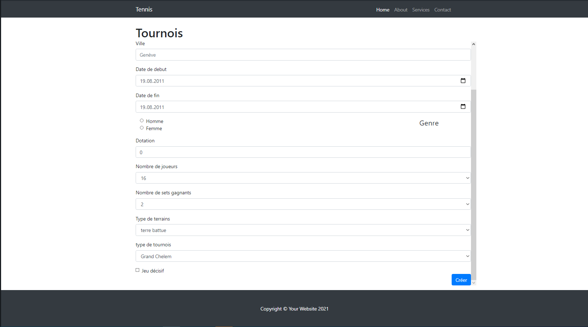

# DOCUMENTATION UTILISATEUR <!-- omit in toc -->
# Tennis <!-- omit in toc -->

***CFPT-Informatique***

## Tables des matières <!-- omit in toc -->
- [1. Introduction](#1-introduction)
- [2. Navigation](#2-navigation)
- [3. Fonctionnalités](#3-fonctionnalités)
  - [3.1. Recherche de tournois](#31-recherche-de-tournois)
  - [3.2. Création](#32-création)
  - [3.3. Moidification](#33-moidification)
  - [3.4. Recherche de joueur](#34-recherche-de-joueur)
  - [3.5. Planification des matches](#35-planification-des-matches)
  - [3.7. Redirection page pricipale](#37-redirection-page-pricipale)
  - [3.8. Suppression d'un tournois](#38-suppression-dun-tournois)
  - [3.9. Copier](#39-copier)
- [4. Pages](#4-pages)
  - [4.1. Page index](#41-page-index)
  - [4.2. Page Creation](#42-page-creation)
  - [4.3. Page Modification](#43-page-modification)
  - [4.4. Page Joueur](#44-page-joueur)
  - [4.5. Page Tournois](#45-page-tournois)

## 1. Introduction
> Le site ***Tennis*** permet de créer, modifier, supprimer des tournois. L'utilisateur peut visualiser un tournois ainsi qu'enregistrer les données des matches et de télécharger le résultat des matches
## 2. Navigation
> Lorsque l'utilisateur arrive sur le site, il a accès à la page création. Lorsqu'un tournois est créé, l'utilisateur a accès à trois nouvelles pages. Il peut naviguer à travers les pages modifications, joueurs et tournois (permet de visualiser le tournois).

## 3. Fonctionnalités
### 3.1. Recherche de tournois
> Sur la page pricipale, se trouve une barre de recheche.
> L'utilisateur peut entrer du texte et cliquer sur le bouton recherche qui affichera les tournois dont le ou les mots resemble au nom du tournois.

### 3.2. Création
> Sur la page création, l'utilisateur doit remplir un formulaire puis valider son formulaire en cliquant sur le bouton "Créer".

### 3.3. Moidification
> La page est la même que la page création mais le formulaire contient déjà les informations du tournois. L'utilisateur n'a plus qu'à changer les données qu'il veut et de valider le formulaire en cliquant sur le bouton "Modifier".

### 3.4. Recherche de joueur
> Sur cette page l'utilisateur peut rechercher par le nom ou le prénom un joueur grâce à une barre de recherche.

### 3.5. Planification des matches
> Sur la page tournois, l'utilisateur peut rentrer les données du match séléctionné (heure, date, résultat).

### 3.7. Redirection page pricipale
> Sur chaque page l'utilisateur peut à tout moment revenir sur la page principale en cliquant sur le titre du site en haut de la page (Tennis). Il sera alors redirigé sur la page principale.

### 3.8. Suppression d'un tournois
> L'utilisateur peut supprimer un tournois en cliquant sur le lien "Supprimer" à coté d'un tournois.

### 3.9. Copier
> L'utilisateut peut copier un tournoi en cliquant sur le lien "Copier" à coté d'un tournois. Ca aura pour effet de recréer le même tournoi.

## 4. Pages
### 4.1. Page index
> C'est sur cette page que l'utilisateur ce trouvera lorsqu'il arrivera sur le site. C'est sur cette page qu'il aura accès aux pages création, modification, tournois et joueurs. Les tournois créés s'afficheront sur cette page. Lorsqu'un tournois est créé, l'utilisateur peut le visualiser, le copier, le supprimer, voir les joueurs du tournois et le modifier.

### 4.2. Page Creation
> Sur cette page se trouve un formulaire que l'utilisateur doit remplir. A la fin de ce formulaire, se trouve un bouton permetant de créer le tournois. Lorsque le bouton sera cliqué, l'utilisateur sera redirigé sur la page principale et le tournois apparaîtra.

### 4.3. Page Modification
> Sur cette page se trouve un formulaire déjà remplit avec les données du tournois. L'utilisateur a juste à modifier le champ qu'il souhaite et cliquer sur le bouton modifier. Il sera redirigé sur la page pricipale et les données du tournois auront changé.

### 4.4. Page Joueur
> Sur cette page l'utilisateur peut effectuer des recherches sur les joueurs du tournois.

### 4.5. Page Tournois
> Sur cette page, un bracket du tournois apparaît avec les premiers matches déjà créé. L'utilisateur peut entrer les données des matches et passer au suivant. Il peut aussi télécharger un pdf du match.

