# Journal de bord
## Date: 03.05.2021
### Heure: 07:34

> Lecture de l'énoncé du TPI
> J'envoie un mail à mon formateur pour pouvoir discuter de l'énoncé et de lui poser des questions

### Heure: 07:45
> Je commence le début de la documentation.
> J'écris l'introduction de ma documentation technique ainsi que le rappel de l'énoncé et le résumé du cahier des charges (Organisation, Livrables, Matériel à disposition, Description de l'application).

### Heure: 09:07
> Je commence le point méthodologie.

### Heure: 9:40 - 10:05
> Durant la pause, j'ai interrompu le point méthodologie pour posé des questions sur l'énoncé de mon tpi à mon formateur.

### Heure: 10:10
> Après une petite pause, je continue la méthodologie.

### Heure: 11:12
> Je commence la planification
> Ainsi que le planing prévisionnel et effectif

### Heure: 12:40
> Après avoir relu ma documentation j'ai décidé de reprendre le point méthodologie qui me semblait incomplet. Alors je l'ai retravaillé

### Heure: 13:32
> Je réalise un plan prévisionnel ainsi qu'un plan effectif.

### Heure: 13:50
> Je commence les produckts backlog

### Heure: 14:10
> Je sauvgarde ce que j'ai fais sur github et je prend ma pause

### Heure: 14:45
> Je reprend les products backlog

### Heure: 15:18
> Je ne suis pas sûr d'avoir créé tous les products backlog nécessairent mais je passe désormais à l'affichage du plan prévisionnel, que j'ai fais sur excel, en markdwon

### Heure: 15:40
> Après avoir essayé plusieurs méthodes pour convertir le tableau excel en markdwon je décide de prendre une capture d'écran car le rendu en markdown et en pdf ne me plaît pas 

### Heure: 16:12
> Depuis 15:40 j'essaie exporter une image en markdown mais je n'arrive pas

### Heure: 16:25
> Finalement j'ai enfin réussi à mettre une image dans markdown
> Je vais passé aux sauvgardes et je vais mettre à jour le plan effectif

## Date: 04.05.2021
### Heure: 07:34

> Je commence par la création du modele conceptuel
> J'utilise mysql avec un serveur apache qui se trouve sur debian, alors je lance le serveur 

### Heure: 07:53
> Après avoir bien analyse le modèle conceptuel qui m'a été fournit dans l'énoncé je decide de le refaire avec tout les détails qui manquent dans l'example

### Heure: 09:08
> Après quelques problèmes, j'arrive a un modele qui me plaît
> Au tout début j'avais un mcd qui ressemblait à ça
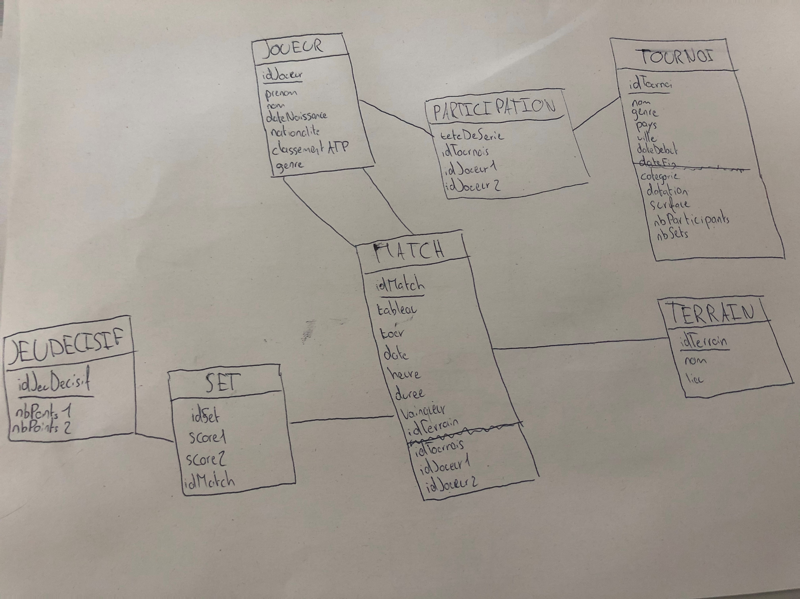

> J'ai ensuite demandé au prof qui nous garde, si c'était un bon mcd
> Il m'a expliqué qu'il y avait mieux à faire et ma conseillé
> Nous sommes arrivés à ça
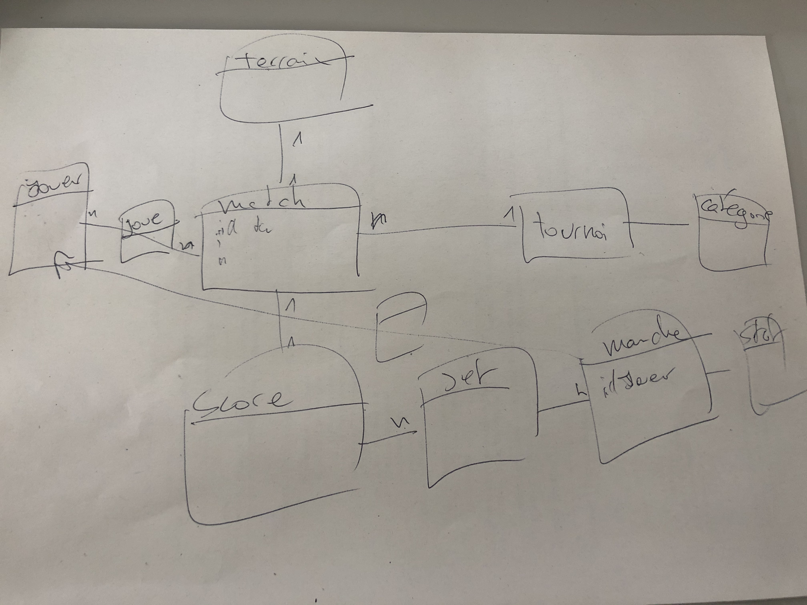

> Ensuite j'ai rajouté les champs qu'il fallait et ça donne ça
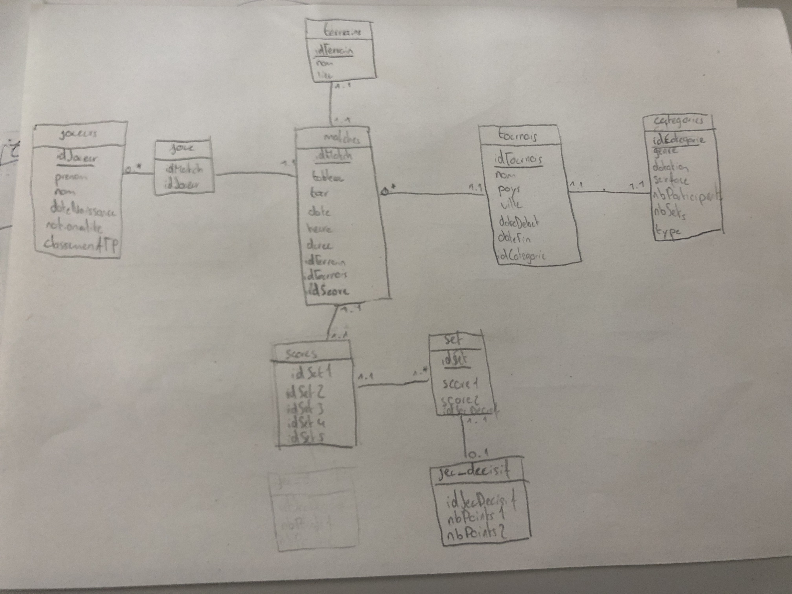
> Je passe à la création du mcd dans la base de donnée

### Heure: 10:10
> Après la pause de 9:40, qui dure jusqu'à 10:05, un de mes camarades m'a fait remarqué qu'il y a de la redondance avec la surface du terrain et le type de tournois dans la table catégorie alors j'ai légèrement modifié le dernier mcd que j'ai fais
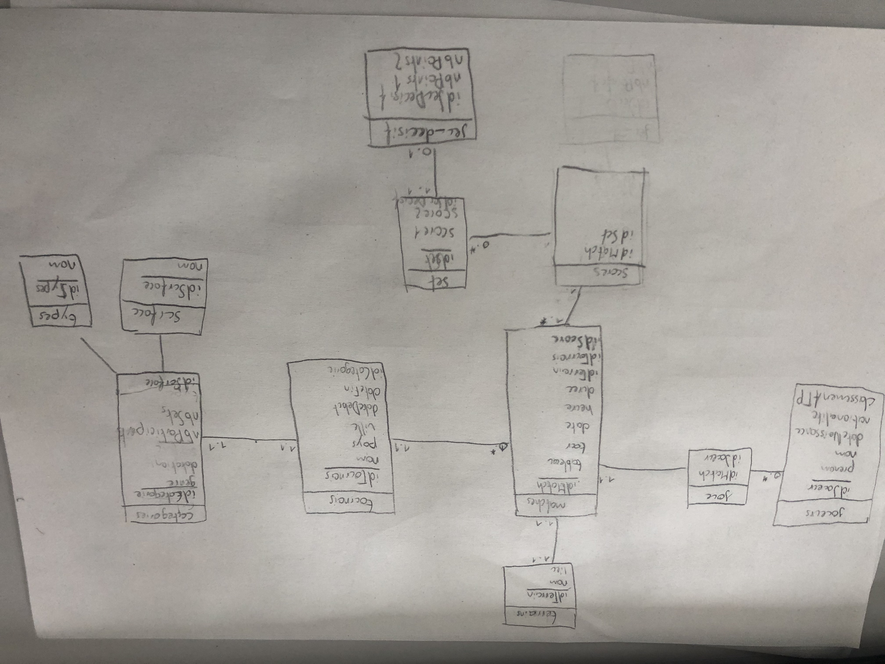

### Heure: 11:16
> J'ai bientôt terminé la création de ma base de donnée, je pensais que ça me prendrait beaucoup moins de temps
> Je me suis rendu compte qu'il peut y avoir de la redondance avec les tours des matches
> Du coup j'ai créé une table en plus
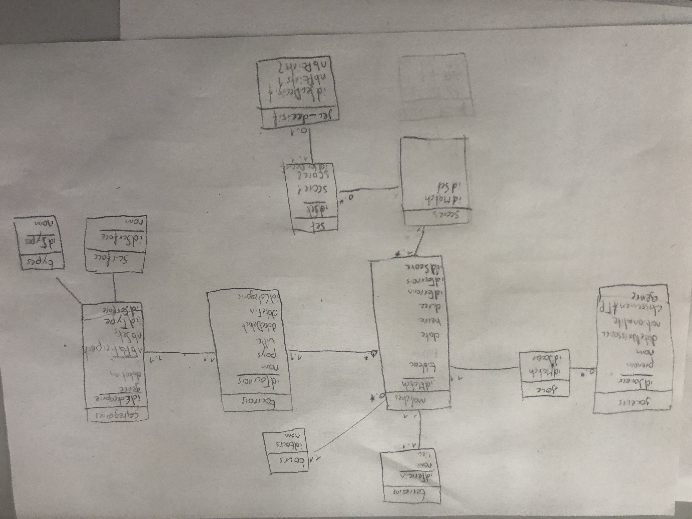

### Heure: 11:29
> Je termine la création de la base de donnée maintenant
> Je sauvgarde mon travail et je pars en pause de midi

### Heure: 12:47
> Je passe désormais au devloppement de la page tournois, la page principale

### Heure: 13:23
> Après avoir cherché un outil me permettant de faire une maquette du site je decide finalement de le faire papier crayon pour plus de facilité

### Heure: 13:53
> J'ai terminé la maquette sur papier
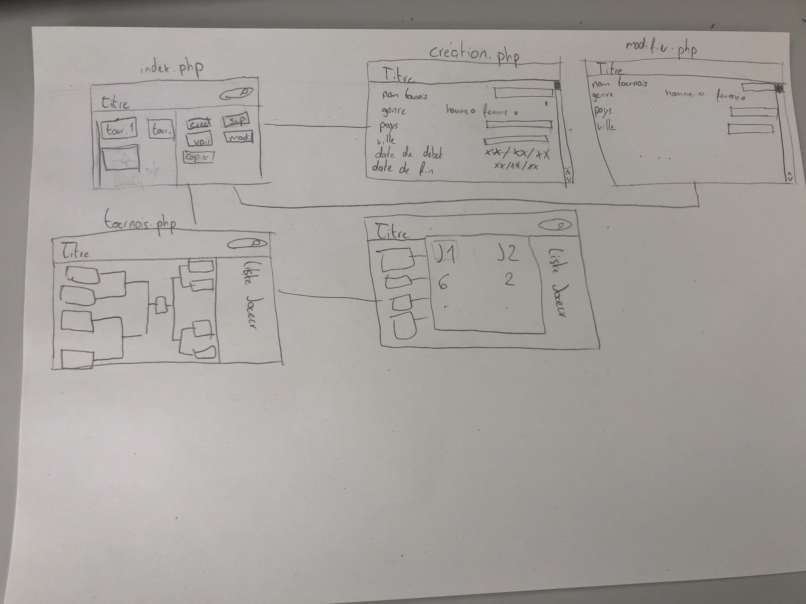
> Je passe maintenant au squelette de mon site

### Heure: 14:45
> Alors que je cherchais une template pour mon squelette de site, après la pause, qui a commencé a 14:15 et s'est terminé à 14:35, un de mes camarades m'a donné un lien pour un site qui propose des template [(Start Bootstrap)](https://startbootstrap.com/templates)
> J'implémente alors dans ma page squelette la template

### Heure: 14:58
> Je rencontre un nouveau problème
> Je n'ai pas toutes les permissions dans mes dossiers alors je dois changer les permissions

### Heure: 16:09
> Le problème a été résolu et la template resemble a ça
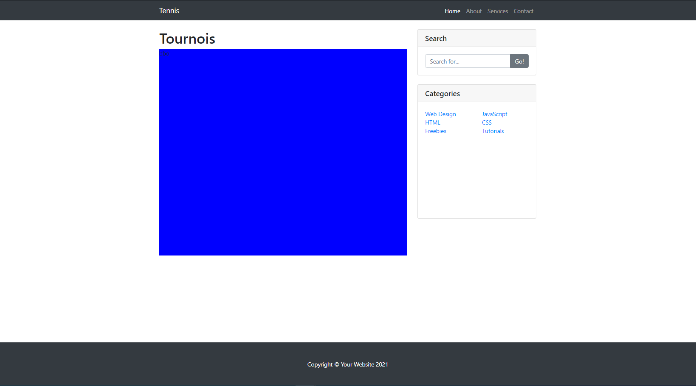

## Date: 05.05.2021
### Heure: 7:30
> Je commence à travailler et je commence a faire les fonctionnalités pour créer un tournois

### Heure: 07:55
> Pour rendre des boutons plus jolie j'utilise la doc bootstrap
> [(Documentation Bootstrap)](https://getbootstrap.com/docs/4.0/components/buttons/)

### Heure: 9:50
> Je passe au php 

### Heure: 10:00
> J'ai créer une fonction pour me faciliter les choses
> Cette fonction permet de se rediriger sur une autre page en ayant en paramètre le chemin d'acces à la page

### Heure: 12:45
> Après la pause de midi je continue la création de la page creation.php
> J'ai bientot terminé la création de la page
> Il reste à implémenter les valeurs entrées dans la base de donnée

### Heure: 13:37
> J'ai réussi à filtrer tous les inputs, j'ai pris beaucoup de temps car j'ai fais beaucoup de fautes d'natentions comme par example mal tapé le name d'un input

### Heure: 14:09
> J'ai terminé les fonctions qui permettent d'inserer les données de la page création dans la table tournois et la table catégorie
> Par contre je n'ai pas encore tester les fonctions
> Je pars en pause

### Heure: 14:40
> Je rentre de pause et je vais tester les fonctions que j'ai réalisé précedement

### Heure: 15:00
> J'ai eu une erreur avec les paramètres de ma fonction insertCategorie
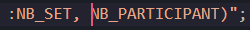
> Il manquait les :
> Maintenant j'ai une autre erreur que le débegueur affiche pas

### Heure: 15:27
> J'ai résolu le problème pour la fonction insertCategorie mais je ne sais pas pourquoi ça marche
> Par contre j'ai une autre erreur pour la fonction recupIdCategorie et insertTournois

### Heure: 15:31
> Pour la fonction recupIdCategorie, l'erreur était que je n'avais pas bien nommé le champ que je voulais récupérer
> J'ai marqué idTournois alors que je voulais idCategorie

### Heure: 15:50
> Le paramètre pdo n'était pas juste, c'était marqué PDO::PARAM_BOOL
> Alors qu'il fallait qu'il soit PDO::PARAM_INT
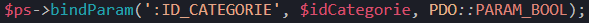

### Heure: 16:00
> Après une pause je continue la documentation 
> Je commence l'analyse fonctionnelle

## Date: 06.05.2021
### Heure: 07:40
> Après être rentré en classe et d'avoir allumé mon poste, je commence la création de la fonctionnalité supprimé

### Heure: 08:08
> J'ai terminé les fonctions deleteTournois et deleteCategorie
> Pour l'instant les fonctions suppriment juste le dernier tournois créé mais je compte trouver un moyen pour afficher les tournois créés et lorsqu'on clique sur un des tournois on peut le supprimer
> Je passe maintenant à la page modifier

### Heure: 08:50
> J'ai eu un problème, que j'ai résolu
> Le problème était que je voulais passer des données en get entre 2 page (index.php -> modification.php) et j'avais une erreur qui disait "a non-numeric value encountered"
> Mon code était ça
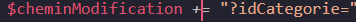
> Je ne devais pas faire un += mais un .= qui est une concatenation
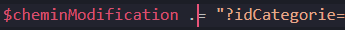
> Le programme pensait que $cheminModification était une valeur numérique et c'est donc pour ça que l'erreur s'affichait

### Heure: 10:09
> Retoure de pause, je continue la cération de la page modification.php ainsi que ses fonctions

### Heure: 11:07
> J'ai des erreus dans mes fonctions car elles retourne false
> Je vais tester les requettes dans ma base de données

### Heure: 11:26
> Les fonctions qui permettent de mettre à jour le tournois fonctionnent
> Le problème était qu'un des paramètres était un tableau et que je ne renseignais pas la valeur dans le tableau
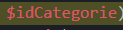
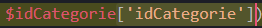

### Heure: 11:30
> J'enregistre tout et je pars en pause de midi

### Heure: 12:36
> Je reviens de pause
> Je vais insérer minimum 48 joueurs (32 joureurs et 16 joueuses)
> Pour aller plus vite, je cherche sur internet avec les informations dont j'ai besion
> Puis je les copie dans notepad++ pour en faire une table afin d'inserer les données dans ma base de donnée
> Le prof de classe m'a aidé pour optimiser mon travail et l'implémentation des données dans la base de donnée

### Heure: 14:00
> Tous les joueurs ont été importé

### Heure: 14:07
> Après la pause de 14:15, je vais commencer l'affichage des tournois sur la page index.php

### Heure: 15:15
> Après le rendez-vous avec les experts, je continue le dévloppement du menu

### Heure: 15:28
> Je me rend compte que ce que je voulais faire est trop compliqué et que ça me prend trop de temps
> Je voulais qu'on puisse séléctionner un tournois et ensuite utiliser les boutons pour interagir avec.
> Mais je change les plans que j'ai fais et je vais faire en sorte que pour chaque tournois créé un bouton supprimé, modifié et voir vont être attribués à chaque tournois
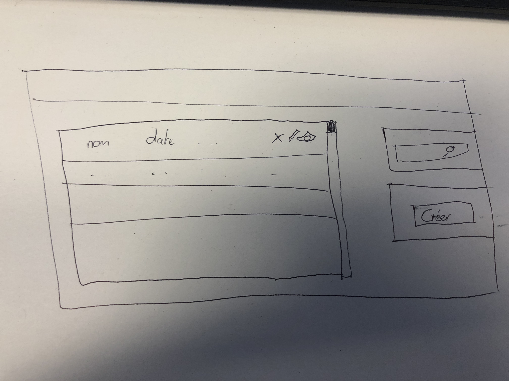

### Heure: 15:51
> J'ai du rajouter une page supprimé mais qui sert juste à supprimer les données du tournois selectionné
> Après la page supprimé revient directe sur la page index

## Jour: 10.05.2021
### Heure: 07:40
> Lorsque je suis entré en classe, j'ai d'abord regardé mon planning prévisionnel
> Ensuite, j'écris un mail à mon fomrateur pour lui poser deux questions qui m'étais venu pendant le week-end
> Les deux questions sont que doit faire le bouton copier et comment je dois enregistrer un match

### Heure: 07:45
> Je commence la documentation
> Je continue l'analyse fonctionnel

### Heure: 07:55
> En voulant prendre des captures de chacunes de mes pages je me rend compte qu'il y a un problème sur la page modification.php
> Les champs ne sont pas tous instanciés avec les valeurs du tournois
> Je décide donc de régler le problème

### Heure: 08:18
> J'ai reglé le problème
> J'ai juste changé la méthode de passage de données entre la page index et modification
> Au lieu de passer toutes les données, je passe juste idTournois et je récupère toutes les données de l'autre coté avec la méthode recupTournoisInfoById
> Je continue la documentation

### Heure: 08:30
> Après avoir fais l'analyse fonctionnel, je décide de faire la recherche de tournois

### Heure: 09:10
> J'ai un problème avec un bouton, le isset ne fonctionne pas
> J'appelle le prof qui nous surveille
> Le prof n'a pas réussi à m'aider

### Heure: 09:18
> Après avoir demander de l'aide à un camarade, l'erreur a été réparer
> Je n'avais pas mis de method et d'action dans ma form

### Heure: 09:26
> J'ai des erreurs que je ne comprend pas entièrement
> Je préfère arrêter la et demander l'aide du prof qui nous garde le mardi car il connait bien le php
> Je commence le devloppement de la page tournois.php